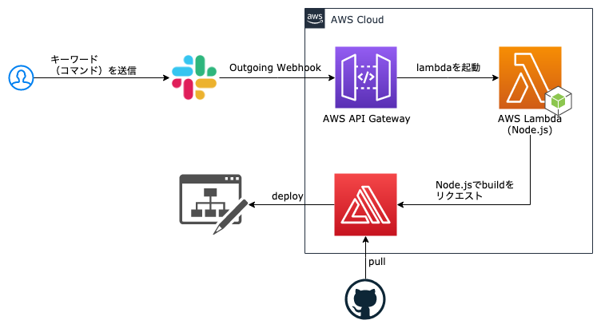
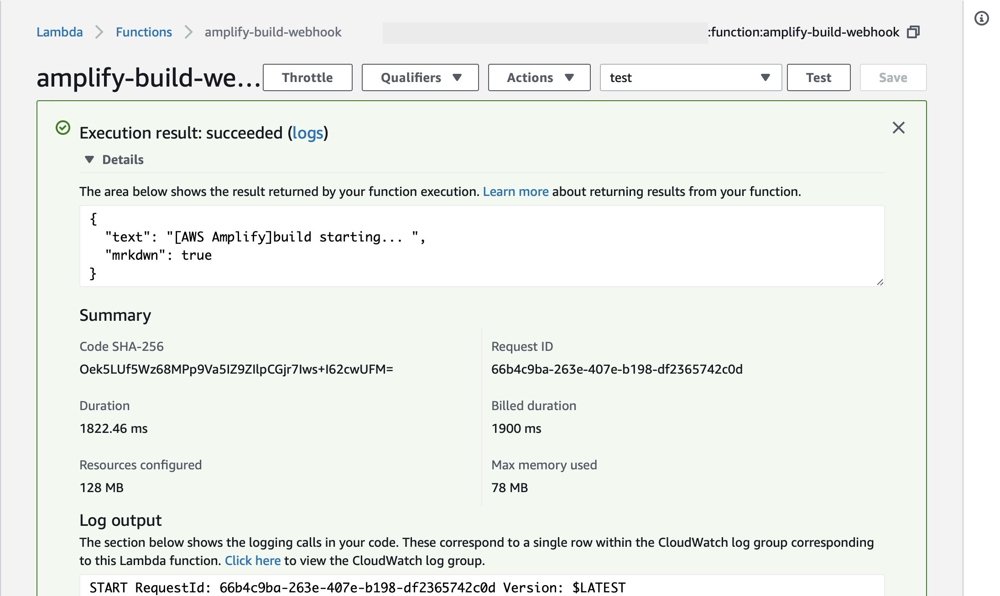
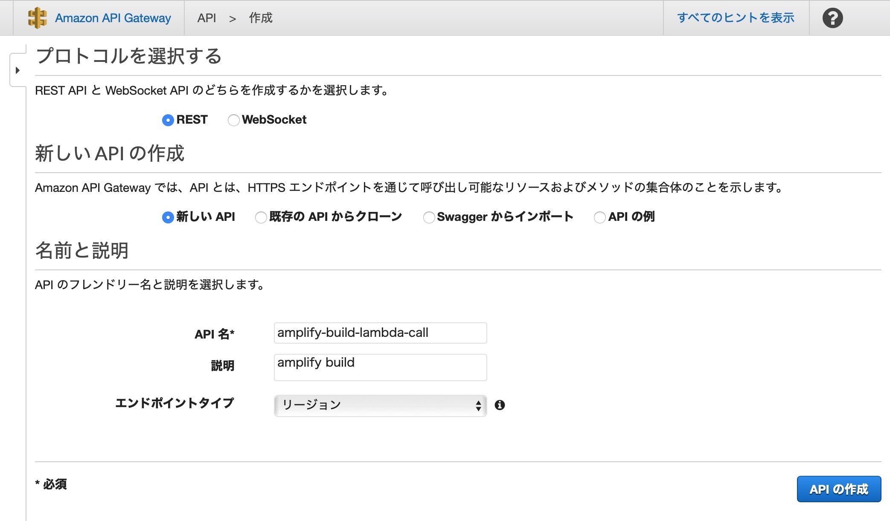
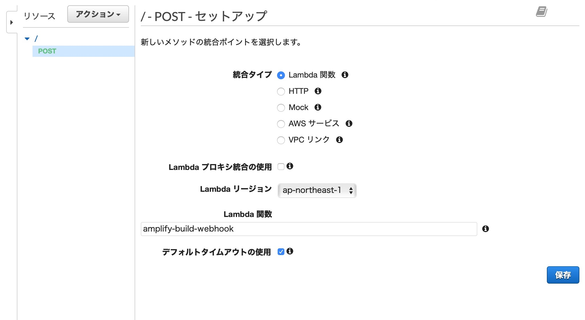
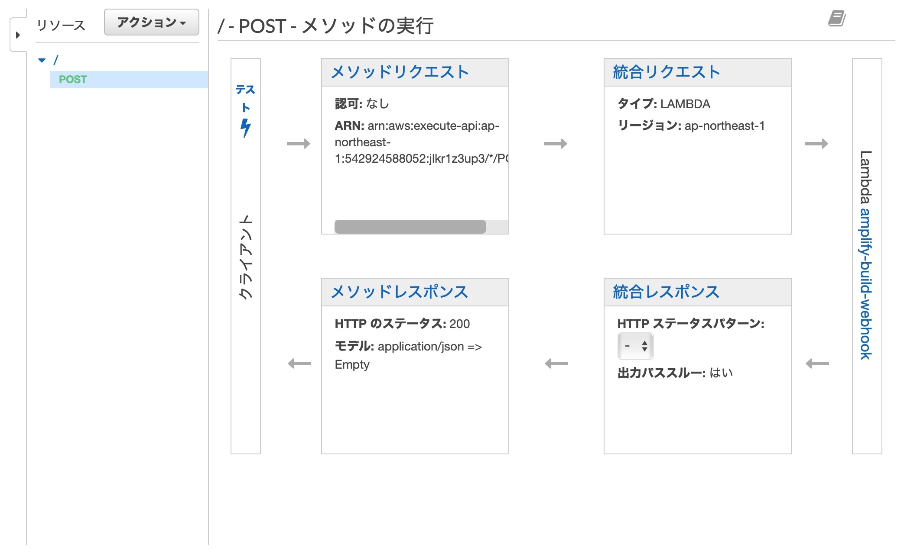
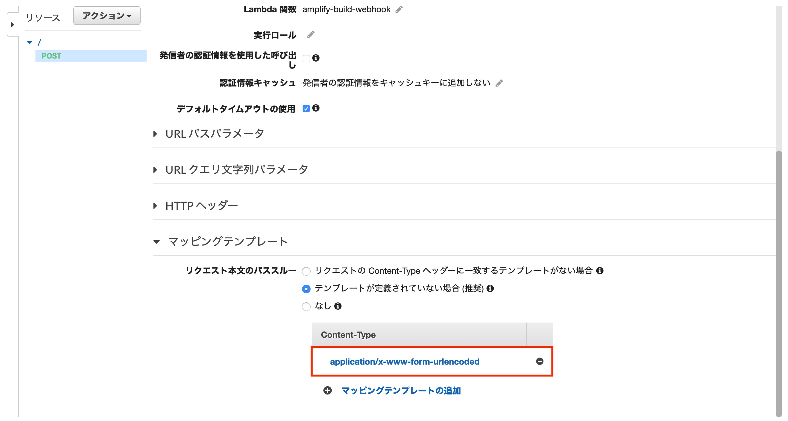
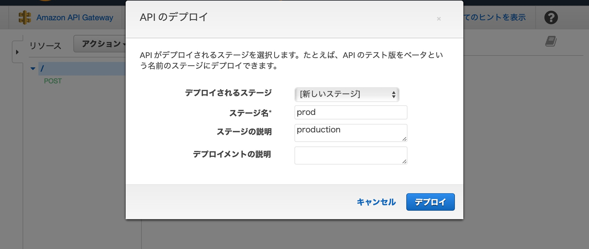
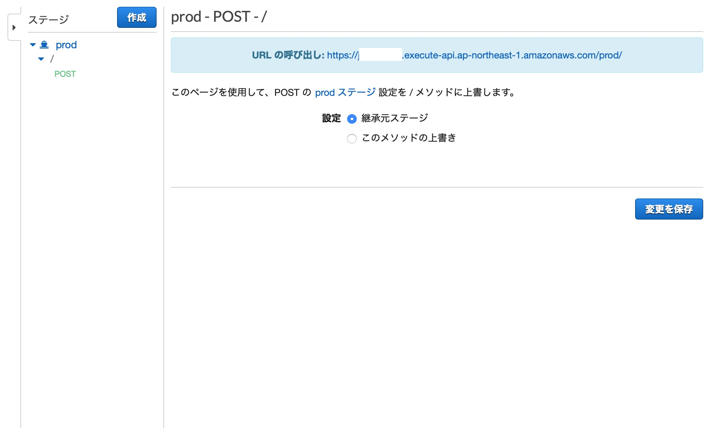
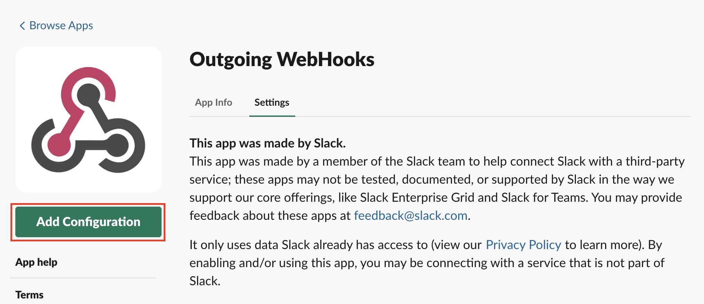
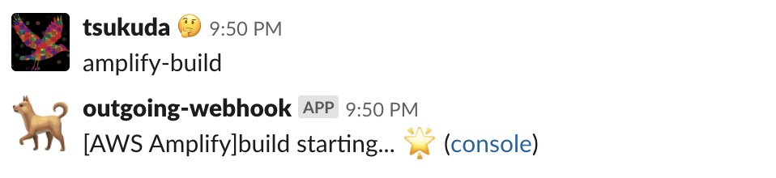

+++
title="AWS Amplify を Slack からデプロイする"
[taxonomies]
tags=["API Gateway", "AWS", "Lambda", "Slack", "amplify"]
+++

```
⚠️ 2019/07 の段階でOutgoing WebhooksはLegacy扱いとなり、
   SlackAppへの移行が推奨されています。
```

---

AWS Amplify は通常コミット時に自動的にデプロイのスクリプトが走りますが、
Git で管理していないデータを取り込んだりする際には、
以下のように [amplify-cli](https://github.com/aws-amplify/amplify-cli) のコマンドをローカルから叩いて実行する必要があります。

```sh
$ export AWS_PROFILE=deploy-profile
$ amplify push
```

シンプルにはこれでよいのですが、

- amplify コマンドを実行するときにローカルの aws ユーザを切り変えたりするのが面倒
- amplify-cli が入っていない別の PC では実行できないといった問題が発生する

上記のような問題から以下のフローのように Slack から deploy を実行できるようにしたいと思います。



## AWS Amplify の Incoming webhooks の設定

AWS Amplify には Zapier や Jenkins など外部のサービス・ツールからでもビルドをトリガするための webhook が用意されています。
document はこちら[Incoming Webhooks](https://docs.aws.amazon.com/amplify/latest/userguide/webhooks.html)

AWS Amplify のコンソールから*ビルドの設定*の下部の Incoming webhooks を新規に作成します。
生成された Command をを実行するとビルドを実行できることがわかります。

```
$ curl -X POST -d {} \\
  "<https://webhooks.amplify.ap-northeast-1.amazonaws.com/prod/webhooks?id=xxxx&token=xxxxxx&operation=startbuild>"\\
  -H "Content-Type:application/json"

> {"SendMessageResponse":{"ResponseMetadata":{"RequestId":"...

```

## AWS Lambda からビルドを実行する

Slack の Outgoing WebHooks でこの URL を呼び出せるといいのですが、
Outgoing WebHooks から POST するとコンテンツの形式が`JSON`でなく`form-urlencoded`で送られてしまうので、うまく送信できないようです 😓

なので、上記のコマンドを Lambda で起動できるようにスクリプトを作成します。

AWS Lambda を開き、以下のように node.js の関数を作成します。(POST のリクエストができればいいので、正直言語は何でもいいです)

以下のような、シンプルな POST リクエストの関数を作成します。

```js
const https = require('https');
// AWS Amplifyから生成されたもの
const amplifyId = 'xxxxxxx-xxxx-xxxx-xxxx-xxxxxxxxxxxx';
const token = 'xxxxxxxxxxxxxxxxxxxxxxxxxxxxxxxxxxxxxxxx';

const options = {
  hostname: 'webhooks.amplify.ap-northeast-1.amazonaws.com',
  port: 443,
  path: `/prod/webhooks?id=${amplifyId}&token=${token}&operation=startbuild`,
  method: 'POST',
  headers: {
    'Content-Type': 'application/json'
  }
};

exports.handler = (event) => {
  return new Promise((resolve, reject) => {
    const req = https.request(options, (res) => {
      console.log(`statusCode: ${res.statusCode}`);

      res.on('data', (d) => {
        // レスポンスに`text`を返すことでそれをslackに表示できる
        const response = {
          text: '[AWS Amplify] build starting...'
        };
        resolve(response);
      });
    });

    req.on('error', (error) => {
      console.error(error);
      reject(error);
    });

    req.end();
  });
};
```

AWS Lambda 上で「テスト」を実行し、成功したら OK です。



Slack へのメッセージのカスタマイズは
[Formatting messages | Slack](https://api.slack.com/docs/message-formatting#linking_to_urls)
を参照ください。

## AWS API Gateway の設定

AWS API Gateway から Lambda を起動するようにします。

まずは API Gateway で新しい REST の API を作成します。



POST アクションを作成し、上記で作成した Lambda 関数を指定します。



クライアントの「テスト」を実行し、正常に動作していることを確認します。（現状引数はなくてもよいので指定する必要はないです）



Slack の Outgoing WebHooks から送られてくる POST リクエストは本文のコンテンツの形式（Content-Type）が`application/x-www-form-urlencoded`になっているので、それを JSON として扱えるように変換する必要があります。

リクエストのマッピングテンプレートに

```
application/x-www-form-urlencoded
```

を追加し、
マッピングテンプレートは以下のようにします。



```
## POSTで送られてきたデータ変数に入れる
#if ($context.httpMethod == "POST")
 #set($rawAPIData = $input.path('$'))
#else
 #set($rawAPIData = "")
#end

## &で区切られたKey-Valueをセットにする
#set($tokenisedAmpersand = $rawAPIData.split("&"))
#set($tokenisedEquals = [])

#foreach( $kvPair in $tokenisedAmpersand )
 #set($countEquals = $kvPair.length() - $kvPair.replace("=", "").length())
 #if ($countEquals == 1)
  #set($kvTokenised = $kvPair.split("="))
  #if ($kvTokenised[0].length() > 0)
   ## we found a valid key value pair. add it to the list.
   #set($devNull = $tokenisedEquals.add($kvPair))
  #end
 #end
#end

## "{" と "}"で括り、出力する
{
#foreach( $kvPair in $tokenisedEquals )
  #set($kvTokenised = $kvPair.split("="))
 "$util.urlDecode($kvTokenised[0])" : #if($kvTokenised[1].length() > 0)"$util.urlDecode($kvTokenised[1])"#{else}""#end#if( $foreach.hasNext ),#end
#end
}

```

次に外側から呼び出すために「ステージ」が必要なので、
アクションから _API のデプロイ_ を選択し、新しいステージを作成します。



ステージにデプロイされた POST リクエストを確認します。



```sh
$ curl -X POST \\
  <https://xxxx.execute-api.ap-northeast-1.amazonaws.com/prod/> \\
  -H "Content-Type:application/x-www-form-urlencoded"

> {"text": "..."}

```

Lambda 関数で定義した戻り値が表示されていることを確認できます。

## slack から API を呼び出す

slack の apps 設定ページ(https://[YOUR_ORG].slack.com/apps)から outgoing webhook を追加し、
"Add Configuration"から新規の webhook を追加する。



例として、以下のように設定する。

- Channel ... #general
- Trigger Word(s) ... `amplify-build`
- URL(s) ... [https://xxxx.execute-api.ap-northeast-1.amazonaws.com/prod](https://xxxx.execute-api.ap-northeast-1.amazonaws.com/prod) (API 　 Gateway で生成された URL)
- Token ... そのまま

Descriptive Label、Customize Name、Icon はなんでも OK です。

slack で`amplify-build`と発言すると Lambda が動作し、amplify のビルドが実行されていることが確認できました。
引数等も調整すればいろんなブランチへのデプロイも指示できそうですね。


