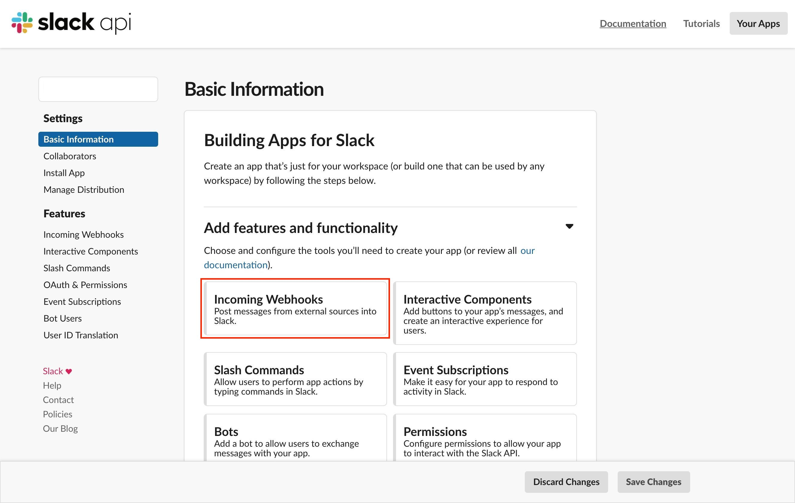
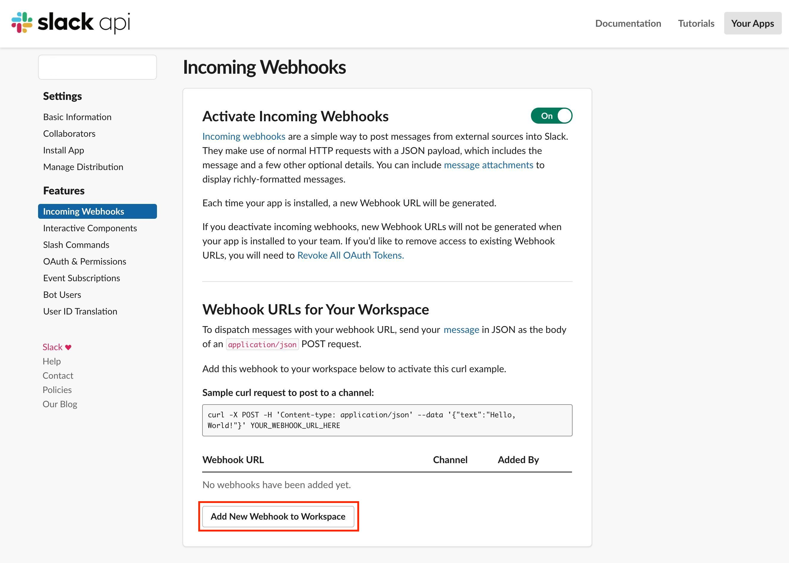
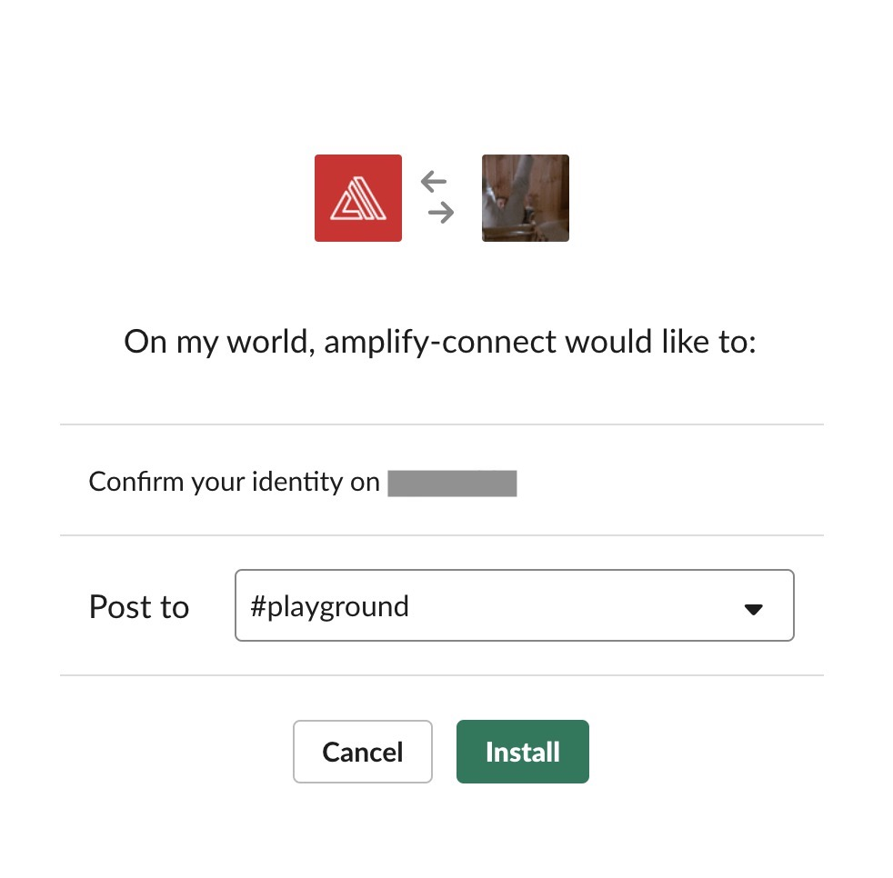

+++
title="Amplifyのデプロイ通知をSlackに通知する(Slack App編)"
[taxonomies]
tags=["Incoming Webhooks", "Lambda", "Slack", "Slack App"]
+++

### パネル

[前回](https:)の記事でレガシーになっている Slack の Incoming Webhooks での通知方法を書いたので、
今回はそれを新しい方の Slack App で実行する方法を書きたいと思います。

といってもやり方は簡単で、

- Slack App を作成、自分の Slack 環境にインストール
- Incoming Webhook の URL が新たに発行されるのでそれに置き換える
- 若干のメッセージの形式に変更があるので直す

というような順になります。

## Slack App の作成

[https://api.slack.com/apps](https://api.slack.com/apps) で新たに App を作成します。

作成されたアプリの Incoming Webhooks を選択し、有効化します。





通知先のチャンネルを選択します。



そうすると新たな URL が発行されるので、Lambda の POST リクエストしている箇所に貼り付けます。

```js
const options = {
  hostname: 'hooks.slack.com',
  port: 443,
  path: '/services/XXXXXXX/XXXXXXX/YYYYYYYYYYYYYY', // ← 新しいURLに変える
  method: 'POST',
  headers: {
    'Content-Type': 'application/json', // ← x-www-urlencodedの場合、jsonに変更
    'Content-Length': data.length
  }
};
```

旧 Incoming Webhooks では channel，username や emoji_icon が都度変更可能でしが、Slack App の場合は変更不可能になりました。
その代わり？に柔軟な[messaging](https://api.slack.com/messaging)が作成可能になりました。

## Reference

- [Incoming Webhooks \| Slack](https://api.slack.com/incoming-webhooks)
- [slack の Incoming webhook が新しくなっていたのでまとめてみた \- Qiita](https://qiita.com/kshibata101/items/0e13c420080a993c5d16)
