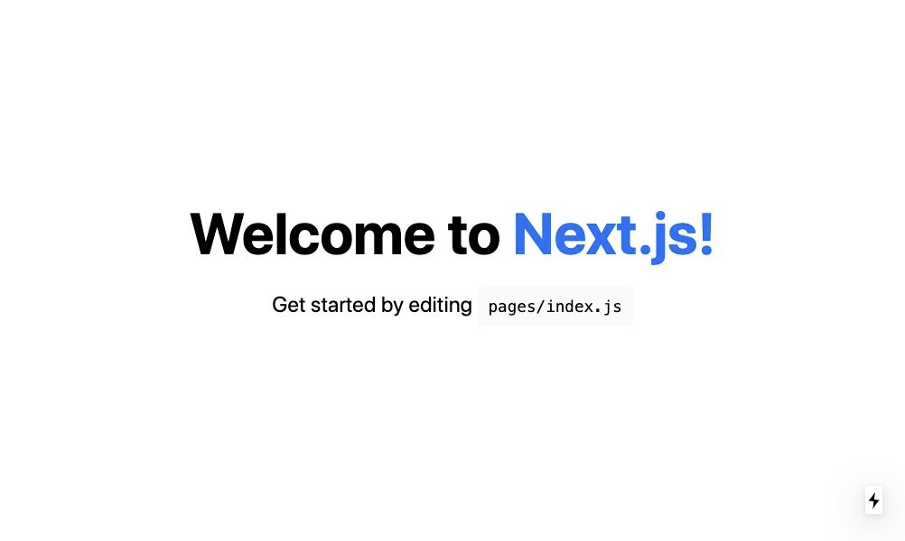

+++
title="Next.jsにてContextとhookで多言語対応する"
[taxonomies]
tags=["Next.js", "React", "TypeScript", "i18n"]
+++

Next.js(React)で多言語対応をしたい場合、[isaachinman/next-i18next](https://github.com/isaachinman/next-i18next)などのライブラリはありますが、ちょっと多機能すぎて、ブラックボックスな部分が多いと感じたので、簡単に自作してみることにしました。

## 準備

とりあえず Next.js の環境を用意します。

```
$ npx create-next-app demo --use-npm --example "<https://github.com/vercel/next-learn-starter/tree/master/learn-starter>"
$ cd demo
```

TypeScript を利用するのでその設定を追加。

```
$ touch tsconfig.json
$ npm install --save-dev typescript @types/react @types/node
```

ローカルサーバで next.js を起動します

```
$ npm run dev
```

pages/index.tsx を最小の設定にします

```ts
import Head from 'next/head';

export default function Home() {
  return (
    <div className="container">
      <Head>
        <title>Create Next App</title>
        <link rel="icon" href="/favicon.ico" />
      </Head>

      <main>
        <h1 className="title">
          Welcome to <a href="https://nextjs.org">Next.js!</a>
        </h1>

        <p className="description">
          Get started by editing <code>pages/index.js</code>
        </p>
      </main>
    </div>
  );
}
```

まずはこのように表示されます。



## 言語ファイルの作成

次に各言語ファイルのを作成します。

```
locales
├── en
│   └── common.json
└── ja
    └── common.json
```

common.json は以下のようにします。

```json
// locales/ja/common.json
{
  "head": {
    "title": "ようこそNext.jsへ!"
  },
  "title": "ようこそ",
  "description": "編集してみましょう"
}
```

```json
// locales/en/common.json
{
  "head": {
    "title": "Welcome to Next.js!"
  },
  "title": "Welcome to",
  "description": "Get started by editing"
}
```

ネストさせても OK な作りにしています。

## Context の作成

画面に表示されるテキスト、現在の言語の設定、言語の設定関数をシステム全体で利用したいのでその Context とその Provider を作成します。

```tsx
import clone from 'lodash/cloneDeep';
import merge from 'lodash/merge';
import * as React from 'react';

export type locales = 'ja' | 'en';

interface LocaleProviderProps {
  lang: locales;
}

interface ContextProps {
  readonly locale: locales;
  readonly localeData: {
    [key: string]: string;
  };
  readonly setLocale: (lang: locales) => void;
}

const getLocaleData = (lang: locales) => {
  let localeData = {};
  const jaData = require('../locales/ja/common.json');
  switch (lang) {
    case 'en':
      localeData = merge(clone(jaData), require('../locales/en/common.json'));
      break;

    default:
      localeData = jaData;
      break;
  }
  return localeData;
};

// Contextを生成
export const LocaleContext = React.createContext<ContextProps>({
  localeData: {},
  setLocale: () => null,
  locale: 'ja'
});

/**
 * LocaleProvider
 */
const LocaleProvider: React.FC<LocaleProviderProps> = ({ children, lang }) => {
  const [locale, setLocale] = React.useState<locales>(lang);
  const [localeData, setLocaleData] = React.useState(getLocaleData(locale));
  // 言語データを更新
  React.useEffect(() => {
    setLocaleData(getLocaleData(locale));
  }, [locale]);

  return <LocaleContext.Provider value={{ localeData, setLocale, locale }}>{children}</LocaleContext.Provider>;
};
export default LocaleProvider;
```

言語の変更(日本語 → 英語) `getLocaleData` が呼び出されそこで json が読み込まれます。
lodash の merge を使い、"en"のデータがない場合自動的に"ja"の値をフォールバックさせる仕組みにしてます。

## hook の作成

Context を呼び出すためにカスタム hook を作成します。[Building Your Own Hooks](https://reactjs.org/docs/hooks-custom.html) を参考。

```tsx
import get from 'lodash/get';
import { useContext } from 'react';

import { LocaleContext } from '../contexts/LocaleContext';

export default function useLocales() {
  const { localeData, setLocale, locale } = useContext(LocaleContext);

  function t(key: string): any {
    const data = get(localeData, key);
    if (!data) {
      console.error(`Translation '${key}' for locale not found.`);
    }
    return data || '';
  }

  return {
    t,
    locale,
    setLocale
  };
}
```

利用される変数は以下の 3 つです

- `t` ... 引数で渡された文字列のキーを json から検索し、値を返します。lodash の get を使い、ドット表記でネストされたキーも引き当てることができます(t は translate の略です)
- `locale` ... 現在の言語の設定を返します。実際は"ja" or "en" の文字列を返します。
- `setLocale` ... 言語の設定を変更する際に呼び出される関数。context 側の useEffect が呼び出されます

## 組み込み

実際に組み込みます

`pages/_app.jsx` を生成し Provider を利用します

```tsx
import { AppProps } from 'next/app';

import LocaleProvider from '../contexts/LocaleContext';

function App({ Component, pageProps }: AppProps) {
  return (
    <LocaleProvider lang="ja">
      <Component {...pageProps} />
    </LocaleProvider>
  );
}

export default App;
```

`<LocaleProvider>` の lang="ja"の部分でデフォルトの言語を設定します。上記では強制的に ja になってますが、ComponentDidMount や getStaticProps 等で、パスやクエリパラメータ、ブラウザのデフォルト言語や保存された値から取得する方法を取るといいです。

次に、 `useLocales`を呼び出して実際の翻訳テキストを表示できるようにします。

```tsx
import Head from 'next/head';

import LocaleSwitch from '../components/LocaleSwitch';
import useLocales from '../hooks/useLocales';

export default function Home() {
  const { t } = useLocales();
  return (
    <div className="container">
      <Head>
        <title>{t('head.title')}</title>
        <link rel="icon" href="/favicon.ico" />
      </Head>

      <main>
        <h1 className="title">
          {t('title')} <a href="https://nextjs.org">Next.js!</a>
        </h1>

        <p className="description">
          {t('description')} <code>pages/index.js</code>
        </p>
      </main>
    </div>
  );
}
```

hook を利用することで pages 以外の Component などどこからでも呼び出すことができます。

## 言語の切り替えを実装

LocaleSwitch コンポーネントを作成し、useLocales の `setLocale` を呼び出します。以下のように実装しました。

```tsx
import * as React from 'react';

import useLocales from '../hooks/useLocales';

interface LocaleSwitchProps {}

/**
 * LocaleSwitch
 */
const LocaleSwitch: React.FC<LocaleSwitchProps> = () => {
  const { setLocale } = useLocales();
  return (
    <div>
      <span
        className="button"
        onClick={() => {
          setLocale('ja');
        }}
      >
        日本語
      </span>
      <span> / </span>
      <span
        className="button"
        onClick={() => {
          setLocale('en');
        }}
      >
        English
      </span>
      <style jsx>{`
        .button {
          padding: 8px;
          cursor: pointer;
          color: #0070f3;
        }
      `}</style>
    </div>
  );
};
export default LocaleSwitch;
```

切り替えができるようになりました。


## まとめ

以上の実装により、リロードなしで言語の切り替えができるようになりました。

---

## 課題点 🤔

簡単に言語の切り替えを実装することはできましたが、以下の点は課題・懸念としてあり、最善ではないかもしれないですが個人的な意見を書いています。

### 改行を含むテキストはどうするのか

改行を含むテキストは json 上で改行文字列( `\n`)を書き、表示するコンポーネントの css にて `white-space: pre-wrap;` もしくは `pre-line` を利用して改行を表現することができます。

### テキスト内にリンクがある場合、どうしても分けないといけない

上記の例でもあるようなテキスト内にリンクがある場合、翻訳テキストを 2 つにわけないといけないです。

```tsx
<h1>
  {t('title')} <a href="https://nextjs.org">{t('titleNext')}</a>
</h1>
```

さらに日本語 < - > 英語で文法上前後が変わってしまう場合はもっと厄介で、仕方なく if 文で分けるしかないのかなと思います。可能であれば、そうならないようにテキスト自体を調整する。

### 配列で保持したい値はどうするか

結論からいうと面倒くさがらず、個々の値を持つようにすることだと思います。

しかしながら、React を使っている以上、配列で記述したいということはあると思います。その場合以下のように翻訳テキストの JSON には配列を記述し、コンポーネントの方で配列として扱うことはできます。

```json
{
  "texts": ["テキスト１", "テキスト２", "テキスト3"]
}
```

```tsx
<ul>
  {t('texts').map((t) => (
    <li key={t}>{t}</li>
  ))}
</ul>
```

ただしこの場合、関数 `t` の戻り値が不定になるので、その点がモヤモヤします。。

### 日付のフォーマットが変わる場合はどうするか

これも多言語機能全般にいえることですが、今回の場合はフォーマット用のコンポーネントを作るとか、でしょうか・・？

簡単に例を書くと、

```tsx
import * as React from 'react';

import useLocales from '../hooks/useLocales';

interface FormatDateProps {
  date: Date;
}

/**
 * FormatDate
 */
const FormatDate: React.FC<FormatDateProps> = ({ date }) => {
  const { locale } = useLocales();
  const y = date.getFullYear();
  const m = date.getMonth() + 1;
  const d = date.getDay() + 1;
  return <span>{locale == 'en' ? `${m}/${d}/${y}` : `${y}/${m}/${d}`}</span>;
};
export default FormatDate;
```

もしくは[moment.js](https://momentjs.com/)や[day.js](https://day.js.org/)で選択されている locale を元に導出するとか。

### SEO 的にはどうか

SEO 的には例えばパスで/en や/ja を指定しそのページを表示しますが、上記ではそれができません。

試してはないですが Next.js の[Routing: Dynamic Routes](https://nextjs.org/docs/routing/dynamic-routes)を使って /pages/[lang]/index.tsx を作り、パスに言語設定を渡すことができると思います。
