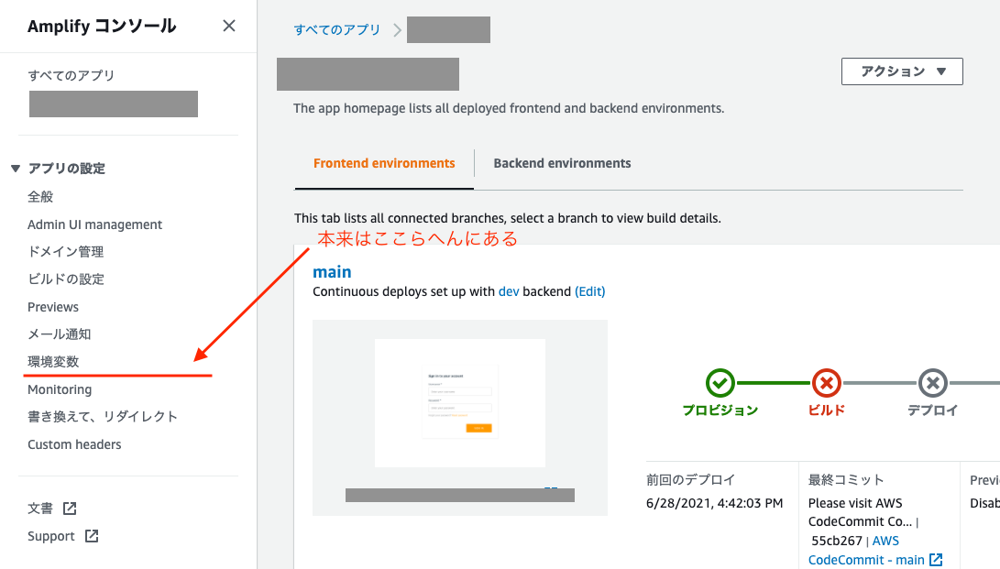

+++
title="AWS AmplifyでCLIからbasic認証の設定を解除する"
[taxonomies]
tags=["AWS", "Next.js", "amplify"]
+++

また Amplify ネタ。

AWS Amplify で next.js(SSR)を利用した frontend の場合、現状 basic 認証が利用できません。

[https://docs.aws.amazon.com/ja_jp/amplify/latest/userguide/server-side-rendering-amplify.html#access-control-unsupported](https://docs.aws.amazon.com/ja_jp/amplify/latest/userguide/server-side-rendering-amplify.html#access-control-unsupported)

> **Access control isn't available for your app**
> Currently, Amplify doesn't support access control for Next.js apps that use SSR. If you are working with an SSR app in the Amplify console, Access control isn't available in the App settings menu in the navigation pane.

今日はハマったのは、数日前に Amplify のコンソールで Basic 認証をセットアップし、今日久々にデプロイしようとしたらビルド時に以下のエラーが発生しました。

```
2021-06-28T07:45:23.067Z [INFO]:
  Build failed: Basic Auth is not supported for SSR apps.
  Please disable Basic Auth before deploying your SSR app.
```

で、設定を Basic 認証を解除するの別によいので、早速解除しようと Amplify のコンソールにアクセスしたところなぜかアクセスコントロールのメニューがなかった。（SSR の場合は表示されないようになっているのかな？）



なので、aws の CLI から以下のコマンドで解除することにしました。aws cli でアカウントを設定した状態で以下を実行します。

```
$ aws amplify update-app --app-id [appのid] --no-enable-basic-auth
```

実行結果が json で吐き出されていれば成功です。

確認する場合は以下のコマンドで確認できます。

```
$ aws amplify get-app --app-id [appのid]
```

```json
{
  "app": {
    "appId": "your_appid",
    // ...
    "enableBasicAuth": false
  }
}
```

`update-app` のその他のオプションはこちらで確認できます

[https://docs.aws.amazon.com/cli/latest/reference/amplify/update-app.html](https://docs.aws.amazon.com/cli/latest/reference/amplify/update-app.html)
