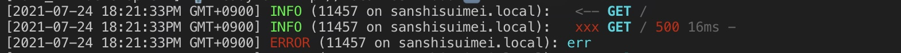

+++
title="Koaあれこれ"
[taxonomies]
tags=["Node.js", "koa", "logging"]
+++

## body parser

[https://github.com/koajs/bodyparser](https://github.com/koajs/bodyparser)

`json`, `form` , `text` , `xml` での body をパースするのに必要。

```tsx
import Koa from 'koa';
import bodyParser from 'koa-bodyparser';

const app = new Koa();
app.use(bodyParser());

app.use(async (ctx) => {
  // request.body に送信されたデータが入る。
  // 空の場合は`{}` となる
  console.log(ctx.request.body);
});
```

TypeScript で body の型を定義する場合は generics を付ける

```tsx
interface UserRequestBody {
  name: string;
  age: number;
}

app.use(async (ctx) => {
  const user = <UserRequestBody>ctx.request.body;
  console.log(user.name);
});
```

## エラーのハンドリングについて

[https://github.com/koajs/koa/wiki/Error-Handling](https://github.com/koajs/koa/wiki/Error-Handling)

```ts
app.use(async (ctx, next) => {
  try {
    await next();
  } catch (err) {
    ctx.status = err.status || 500;
    ctx.body = err.message;
    ctx.app.emit('error', err, ctx);
  }
});

app.on('error', (err, ctx) => {
  /*
   * 全体のエラーを管理する
   * console.log,errorをここで書いたり、ログに書き込んだりする
   * リクエストの内容は引数のctx.requestで確認できる
   */
});
```

`ctx.throw` を利用することで上記同様の処理ができる

```ts
const err = new Error('name required');
err.status = 400;
err.expose = true;
throw err;

↓

ctx.throw(400, 'name required');
```

※ ctx.throw を使うと json は返せない(文字列のみ)、なので、エラー時に json を返したい場合は下記のように手動で書く必要がある。またはそれ用のライブラリを使う。

```ts
ctx.type = 'json';
ctx.status = 500;
const message = 'error occured';
ctx.body = {
  status: 'error',
  message
};

ctx.app.emit('error', new Error(message), ctx);
```

## CORS

`@koa/cors` を使った複数ドメインへの CORS の制御の方法

```ts
import cors from '@koa/cors';

const isDev = process.env.NODE_ENV === 'development';

// 有効なoriginを定義
let validOrigins: string[] = [];
if (!isDev) {
  validOrigins = ['yourdomain.com', 'yourdomain2.io'];
}

const verifyOrigin = ({ headers: { origin = '' } }: Koa.Context) => {
  // 指定がない場合は全部許可（主に開発向け）
  if (validOrigins.length === 0) {
    return '*';
  }
  const valid = validOrigins.some((o) => origin.indexOf(o) > -1);
  if (!valid) return '';
  return origin;
};

app.use(cors({ origin: verifyOrigin }));
```

## logging

リクエストのログは `koa-logger` 、それ以外の logging は `pino` を利用するようにしました。

`logger.ts`

```ts
import pino from 'pino';

const isDev = process.env.NODE_ENV === 'development';

export const logger = pino({
  level: process.env.LOG_LEVEL || isDev ? 'debug' : 'info',
  prettyPrint: {
    colorize: true,
    translateTime: `SYS:yyyy-mm-dd HH:MM:ssTT Z`,
    crlf: true
  }
});
```

```ts
import { logger } from './logger';

// Koa loggerのメッセージをpinoへ流す
app.use(
  koaLogger({
    transporter: (str) => logger.info(str)
  })
);

// 通常のlogはlogger.info等で呼び出す
logger.info('ログです');
```

このように表示されます


