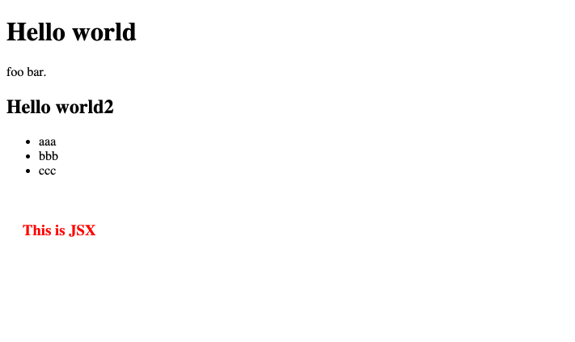

+++
title="Next.js で Markdownから静的ページを生成する"
[taxonomies]
tags=["Next.js", "markdown"]
+++

Next.js で UI をそんなにこだわらない静的ページ(例えばヘルプページやプライバシーポリシーなど）やブログのような記事を開発者以外が編集するような場合、基本的には React で書くよりマークダウンを使って記述し、それを表示した方が早いことがあります。

React で作られたメインのコンテンツとは別にマークダウンをベースにした静的ページを Next.js 上につくりたい場合以下のやり方で実装することができます。（今回のケースは Next.js 内に React で作られたコンテンツと同居させる場合のやり方なので、マークダウンがメインになる場合は[Gatsby](https://www.gatsbyjs.com)やそれに類する静的サイトジェネレータを使った方が効率はよいかもしれません）

## 利用するライブラリ

利用するのは以下の２つのライブラリ

- [next-mdx-remote](https://github.com/hashicorp/next-mdx-remote)
  - Next.js の `getStaticProps` を利用し、ビルド時にマークダウンファイルから静的な HTML ページを生成するためのものです。
- [gray-matter](https://github.com/jonschlinkert/gray-matter)
  - front matter というマークダウンやそれ以外のテキストなどの先頭に `---` で区切られたメタ情報（タイトルや日付など）をパースして取得することができるライブラリ
  - front matter を利用しない場合は不要です

それらをインストールします

```sh
npm i next-mdx-remote gray-matter
```

## コンテンツの用意

まずは元のデータとなるマークダウンを作成します。今回はとりあえず `contents/hello.mdx` というファイルを作成します。ディレクトリは以下のようになります。

```ts
└── src
    ├── components
    ├── contents
    │   └── hello.mdx
    └── pages
        └── index.tsx
```

`mdx`はマークダウンの記述の中に React の JSX の記法を混ぜて書き込むことができるファイルの形式です。

hello.mdx の内容は以下のようにします。

```markdown
---
title: Hello
slug: home
---

# Hello world

foo bar.

## Hello world2

- aaa
- bbb
- ccc

<div style={{ padding: '20px', color: 'red' }}>
  <h3>This is JSX</h3>
</div>
```

## 表示するページの用意

表示させたいページの数やパスが未定の場合、存在するマークダウンファイルに対してのみアクセスをできるようにします。Next.js の Dynamic Route を使って `static/[id].tsx` というページを作成します。

```
└── src
    ├── components
    ├── contents
    │   └── hello.mdx
    └── pages
        ├── index.tsx
        └── static
            └── [id].tsx
```

ファイル全体は以下のようになります

```ts
import fs from 'fs';
import matter from 'gray-matter';
import { GetStaticPaths, GetStaticProps, NextPage } from 'next';
import { MDXRemote, MDXRemoteSerializeResult } from 'next-mdx-remote';
import { serialize } from 'next-mdx-remote/serialize';
import Head from 'next/head';
import path from 'path';
import * as React from 'react';

const contentDirectory = path.join(process.cwd(), 'src/contents');

const getAllPostSlugs = () => {
  const fileNames = fs.readdirSync(contentDirectory);

  return fileNames.map((filename) => {
    return {
      params: {
        id: filename.replace('.mdx', '')
      }
    };
  });
};

interface StaticProps {
  source: MDXRemoteSerializeResult;
  frontMatter: { [key: string]: any };
}

const components = {
  h1: (props) => <h1 {...props} />,
  h2: (props) => <h2 {...props} />,
  h3: (props) => <h3 {...props} />,
  h4: (props) => <h4 {...props} />,
  p: (props) => <p {...props} />,
  a: (props) => <a {...props} />,
  li: (props) => <li {...props} />
};

const Static: NextPage<StaticProps> = ({ source, frontMatter }) => {
  return (
    <div>
      <Head>
        <title>{frontMatter.title}</title>
      </Head>
      <div>
        <MDXRemote {...source} components={components} />
      </div>
    </div>
  );
};

// 静的ページとして取得するパスを指定
export const getStaticPaths: GetStaticPaths = async () => {
  const paths = getAllPostSlugs();
  return {
    paths,
    fallback: false // 見つからない場合は404とする
  };
};

export const getStaticProps: GetStaticProps = async ({ params }) => {
  const fullPath = path.join(contentDirectory, `${params.id}.mdx`);
  const pageContent = fs.readFileSync(fullPath, 'utf8');
  const { data, content } = matter(pageContent);
  const mdxSource = await serialize(content);
  return {
    props: {
      source: mdxSource,
      frontMatter: data
    },
    revalidate: 600 // sec
  };
};

export default Static;
```

### 解説

コンテンツ（マークダウン）があるディレクトリの位置を指定します。

```tsx
const contentDirectory = path.join(process.cwd(), 'src/contents');
```

後述の getStaticPaths で利用する静的ページとなるファイルがいくつ存在するかを定義します。params の id はファイル名が[id].tsx となっているためこのようになります。

```tsx
const getAllPostSlugs = () => {
  const fileNames = fs.readdirSync(contentDirectory);

  return fileNames.map((filename) => {
    return {
      params: {
        id: filename.replace('.mdx', '')
      }
    };
  });
};
```

マークダウンを HTML に変換された際に利用する component を定義します。スタイルや振る舞いを定義することができます。

```ts
const components = {
  h1: props => <h1 {...props} />,
  ...
};
```

実際にレンダリングされるコンポーネントはこちらになります。MDXRemote にマークダウン(mdx)の文字列を渡すとそれを解釈し HTML として表示されます。

```ts
const Static: NextPage<StaticProps> = ({ source, frontMatter }) => {
  return (
    <div>
      <Head>
        <title>{frontMatter.title}</title>
      </Head>
      <div>
        <MDXRemote {...source} components={components} />
      </div>
    </div>
  );
};
```

Next.js の getStaticPaths です。静的なものとして表示したいページを一覧として `paths` に定義します。ビルド時にそれらを評価し静的なページとして生成します。

つまり、ビルド時に src/contents ディレクトリに配置されているすべてのマークダウンファイルを静的ページとして生成します。

```ts
export const getStaticPaths: GetStaticPaths = async () => {
  const paths = getAllPostSlugs();
  return {
    paths,
    fallback: false // 見つからない場合は404とする
  };
};
```

Next.js の getStaticProps です。静的ページを生成するため params(パス)に指定されたマークダウンファイルを読み込み、gray-matter によって front matter を抽出し、コンテンツをコンポーネント側に返します。

`serialize` 関数により mdx を解釈することができます。

```ts
export const getStaticProps: GetStaticProps = async ({ params }) => {
  const fullPath = path.join(contentDirectory, `${params.id}.mdx`);
  const pageContent = fs.readFileSync(fullPath, 'utf8');
  const { data, content } = matter(pageContent);
  const mdxSource = await serialize(content);
  return {
    props: {
      source: mdxSource,
      frontMatter: data
    },
    revalidate: 600 // sec
  };
};
```

### 表示結果

localhost:3000/static/hello にアクセスすると以下のようなページが表示され、マークダウンが解釈されページが表示されたことがわかります。



## ビルド結果

npm run build すると作成したマークダウンが生成されていることがわかります。

```ts
running command with prefix "build"

> next build
...
info  - Creating an optimized production build
info  - Compiled successfully
info  - Collecting page data
info  - Generating static pages (5/5)
info  - Finalizing page optimization

Page                             Size     First Load JS
┌ ○ /                            256 B            64 kB
├ ○ /404                         3.17 kB          67 kB
└ ● /static/[id]                 3.67 kB        67.5 kB
    ├ /static/foo
    └ /static/hello
+ First Load JS shared by all    63.8 kB
  ├ chunks/framework.64eb71.js   42 kB
  ├ chunks/main.c03421.js        20.2 kB
  ├ chunks/pages/_app.a8eaee.js  801 B
  └ chunks/webpack.672781.js     766 B

λ  (Server)  server-side renders at runtime (uses getInitialProps or getServerSideProps)
○  (Static)  automatically rendered as static HTML (uses no initial props)
●  (SSG)     automatically generated as static HTML + JSON (uses getStaticProps)
   (ISR)     incremental static regeneration (uses revalidate in getStaticProps)
```

foo.mdx というファイルを追加し、実行してみました。●(SSG)の部分に静的な HTML として生成されていることが表示されています。

## まとめ

上記のやり方でマークダウンから静的なページを生成することができました。

一つの Web サイト上で React と静的なページを分けて管理する場合に有効だと思います。

### おまけ

/static を付けたくない場合、next.js の config を書くことでルート直下のパスとしてページを返すことができます。

- /hello → /static/hello を参照
- /foo → /static/foo を参照

※ ただしこの場合、静的なページ名を正規表現で指定することになります。ワイルドカードでやると関係ないページ名なども拾ってしまい、別の箇所で不具合がでることがあります。

```js
const config = {
  async rewrites() {
    return [
      {
        source: '/:id(foo|hello)',
        destination: '/statics/:id'
      }
    ];
  }
};

module.exports = config;
```
