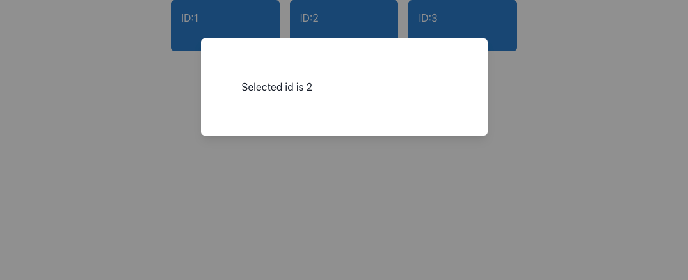

+++
title="Next.jsでダイアログの状態をパラメータで保持する"
[taxonomies]
tags=["Next.js", "React"]
+++

Next.js (React)でモーダルやページ内でステップを表示する際に別の内容を表示しようとする際に、リロードやブラウザバックにより、その状態を保持したり、ユーザが思ったような挙動をしたい場合、location.replace メソッドを使って、ページ遷移をせず、その状態をブラウザに保持することができます。

例えば以下のようにモーダルが開いているような UI の場合、通常は js 内の変数(state)でモーダルの状態を管理することになるため、リロードした場合はモーダルが閉じてしまいます。



なので、この場合に例えば `localhost:3000?id=2` のように URL パラメータをつけることでリロードした際に URL に `id=*` がある場合、モーダルを表示するというような設計をしたいと思います。

また、stepperUI のように、同一ページ内でナビゲートするような UI であってもパラメータで現在のページ位置を保持するようになってれば、ユーザがブラウザの戻るを押してもページ自体はそのままで、ナビゲーションだけを戻すことが可能になります。

[https://material.io/archive/guidelines/components/steppers.html](https://material.io/archive/guidelines/components/steppers.html)

## Next.js での実装例

### replace の例

replace を使う場合は以下のような要件になります。

- モーダル表示時など、なにかの ON・OFF の状態を URL に保持
- リロード時はその URL をチェックし、UI を復元
- ブラウザの戻る場合は前のページに遷移（通常のブラウザ動作と同じ）

Next.js では `useRouter` (および `withRouter` )で history や URL のパラメータの取得・操作ができます。React のみ場合でも react-router などを使えば同様なことができると思います。

ページの実装例は以下になります。(※ UI のライブラリとして [chakra-ui](https://chakra-ui.com/) を使っています）

```tsx
import { NextPage } from 'next';
import { useRouter } from 'next/router';
import * as React from 'react';

import { Box, Container, HStack, Modal, ModalContent, ModalOverlay, SimpleGrid } from '@chakra-ui/react';

interface ParamsProps {}

const PARAMS_KEY = 'id';

/**
 * with params
 */
const Index: NextPage<ParamsProps> = () => {
  const { query, replace } = useRouter();
  const [selectedId, setSelectedId] = React.useState('');

  // パラメータにid=xがある場合、モーダルをデフォルトで表示する
  React.useEffect(() => {
    if (query && query[PARAMS_KEY]) {
      const id = query[PARAMS_KEY] as string;
      setSelectedId(id);
    }
  }, [query]);

  // 選択時、urlを更新する
  React.useEffect(() => {
    if (selectedId) {
      replace(`${location.pathname}?${PARAMS_KEY}=${selectedId}`);
    } else {
      replace(location.pathname);
    }
  }, [selectedId]);

  const handleCloseOverlay = React.useCallback(() => {
    setSelectedId('');
  }, []);

  const handleSelectId = React.useCallback((id) => {
    setSelectedId(id);
  }, []);

  return (
    <Container>
      <Modal blockScrollOnMount={false} isOpen={!!selectedId} onClose={handleCloseOverlay}>
        <ModalOverlay />
        <ModalContent p={16}>Selected id is {selectedId}</ModalContent>
      </Modal>
      <HStack column={3} spacing={4} px={4}>
        {[1, 2, 3].map((id) => (
          <Box
            onClick={() => {
              handleSelectId(id.toString());
            }}
            key={id}
          >
            <span>ID:{id}</span>
          </Box>
        ))}
      </HStack>
    </Container>
  );
};

export default Index;
```

解説など

```tsx
React.useEffect(() => {
  if (query && query[PARAMS_KEY]) {
    const id = query[PARAMS_KEY] as string;
    setSelectedId(id);
  }
}, [query]);
```

この useEffect の部分で今の URL 上にパラメータがあるかどうかを判定します。URL パラメータがある場合はその値を state に設定します。（実際にはパラメータは配列になることがあったりするので、もう少し厳密な validation が必要になります）

```tsx
React.useEffect(() => {
  if (selectedId) {
    replace(`${location.pathname}?${PARAMS_KEY}=${selectedId}`);
  } else {
    replace(location.pathname);
  }
}, [selectedId]);
```

state が更新された場合この useEffect が動作して、replace メソッドを使い history を更新します。

selectId が unset された場合は現在のパス（例えば `"/"` とか)に変更します。

モーダルを表示するかどうか（今回は chakra-ui の Modal を利用しています）は、state に id があるかどうかで判定します。

```tsx
<Modal
  blockScrollOnMount={false}
  isOpen={!!selectedId}
  onClose={handleCloseOverlay}
>
```

### push の場合

push を使う場合は以下のような要件になります。

- stepperUI など、連続したナビゲーションがある場合のそのどこかの状態を状態を URL に保持
- リロード時はその URL をチェックし、UI を復元
- ブラウザの戻る場合は history が更新されるので前のナビゲーションがあればその状態に遷移（初期状態以外はページ自体は遷移しない）

(詳細は端折りますが、)replace との差分としては以下のようになります。

```tsx
React.useEffect(() => {
  if (query) {
    if (query[PARAMS_KEY]) {
      const id = query[PARAMS_KEY] as string;
      setSelectedId(id);
    } else {
      setSelectedId('');
    }
  }
}, [query]);

// ナビゲートを実行する場合
const handleGoNext = React.useCallback((id) => {
  push(`${location.pathname}?${PARAMS_KEY}=${id}`);
}, []);

// 初期状態にする場合など
const handleCloseOverlay = React.useCallback(() => {
  push(location.pathname);
}, []);
```

表示する部分では selectedId の値が何になっているかで、表示するものを変更します。
