+++
title="JavaScript Map vs Object （パフォーマンス編）"
[taxonomies]
tags=["JavaScript", "Map", "Object"]
+++

前記事の続き

[JavaScript Map vs Object（実装編） | kyohei's blog](https://1k6a.com/blog/js-map-vs-object-by-method)

## パフォーマンス

結局、どちらも同じようなことができることはわかったので、パフォーマンス的にどちらを利用するかを検証してみます。

Perflik を利用して、各処理のブラウザでのパフォーマンスを図ってみた。

```
(macOS Monterey)
Chrome Version 99
Safari Version 15.4
Firefox Version 98
(windows 10)
Edge Version 99
```

### 値の登録

`m.set(x, y)` vs `o[x] = y`

いずれのブラウザでも、Object の方が速い。

[Perflink](https://perf.link/#eyJpZCI6InluamQxbW52MnhhIiwidGl0bGUiOiJnZW5lcmF0ZSIsImJlZm9yZSI6ImNvbnN0IGRhdGEgPSBbLi4uQXJyYXkoMTAwMCkua2V5cygpXSIsInRlc3RzIjpbeyJuYW1lIjoiR2VuZXJhdGUgTWFwIiwiY29kZSI6ImNvbnN0IG0gPSBuZXcgTWFwKCk7XG5kYXRhLmZvckVhY2goKGQpID0%2BIG0uc2V0KGQsIGQpKTsiLCJydW5zIjpbMTAwMDAsOTAwMCwxNTAwMCw1MDAwLDE2MDAwLDExMDAwLDUwMDAsOTAwMCwyMDAwLDExMDAwLDMwMDAsMTYwMDAsMTMwMDAsMTYwMDAsMTUwMDAsMTYwMDAsMzAwMCw0MDAwLDQwMDAsNDAwMCwzMDAwLDQwMDAsMTIwMDAsMzAwMCw5MDAwLDEwMDAsMTIwMDAsNzAwMCwxMDAwLDIwMDAsMTQwMDAsNDAwMCwzMDAwLDEwMDAsNDAwMCw5MDAwLDYwMDAsMTMwMDAsMTYwMDAsMTYwMDAsMjAwMCwyMDAwLDQwMDAsMTAwMCwyMDAwLDIwMDAsNDAwMCwxODAwMCwxNDAwMCw1MDAwLDkwMDAsOTAwMCwyMDAwLDUwMDAsMTgwMDAsMTQwMDAsMTcwMDAsMTAwMCwxNTAwMCwxMDAwLDMwMDAsMzAwMCw2MDAwLDcwMDAsNzAwMCwxMDAwLDcwMDAsODAwMCwxNzAwMCwxNjAwMCwxODAwMCwxNzAwMCwzMDAwLDExMDAwLDIwMDAsMTUwMDAsNzAwMCw5MDAwLDE0MDAwLDEwMDAwLDgwMDAsMTcwMDAsMjAwMCwzMDAwLDEwMDAwLDE0MDAwLDE2MDAwLDE2MDAwLDE1MDAwLDUwMDAsNzAwMCwxMDAwMCw0MDAwLDIwMDAsMTgwMDAsMTgwMDAsMTYwMDAsMzAwMCw0MDAwLDUwMDBdLCJvcHMiOjg0NjB9LHsibmFtZSI6IkdlbmVyYXRlIE9iamVjdCIsImNvZGUiOiJjb25zdCBvID0ge307XG5kYXRhLmZvckVhY2goKGQpID0%2BIG9bZF0gPSBkKTsiLCJydW5zIjpbMjEwMDAsMTUwMDAsMTAwMCw5MDAwLDcwMDAsMTkwMDAsMTAwMDAsMTgwMDAsNDAwMCwyNjAwMCwxMDAwLDMxMDAwLDI3MDAwLDI2MDAwLDMyMDAwLDM2MDAwLDUwMDAsNzAwMCw4MDAwLDgwMDAsNzAwMCw2MDAwLDIwMDAwLDYwMDAsMTQwMDAsNjAwMCwyMjAwMCwxMjAwMCwyMDAwLDYwMDAsMzAwMDAsMTgwMDAsNzAwMCwzMzAwMCw2MDAwLDE5MDAwLDUwMDAsMzAwMDAsMzEwMDAsMzQwMDAsMzQwMDAsMjkwMDAsOTAwMCwyMDAwLDcwMDAsNjAwMCwyNjAwMCw0MTAwMCwyMzAwMCwxMTAwMCwxNTAwMCwxNDAwMCwzMDAwMCw0MDAwLDM4MDAwLDMyMDAwLDI5MDAwLDI5MDAwLDI4MDAwLDMyMDAwLDMwMDAsMzEwMDAsMTMwMDAsMTUwMDAsMTUwMDAsMjgwMDAsMjgwMDAsMTEwMDAsMzMwMDAsMzUwMDAsMzQwMDAsMzYwMDAsMjkwMDAsMjAwMDAsNDAwMCwzMjAwMCwxNDAwMCw5MDAwLDI4MDAwLDIxMDAwLDE4MDAwLDM5MDAwLDEwMDAsMzAwMCwyMjAwMCwzMDAwMCwzNDAwMCwxMDAwLDI5MDAwLDcwMDAsMTcwMDAsMjEwMDAsODAwMCw3MDAwLDI5MDAwLDM0MDAwLDMyMDAwLDMwMDAsMTMwMDAsODAwMF0sIm9wcyI6MTg1OTB9XSwidXBkYXRlZCI6IjIwMjItMDMtMjNUMTM6MDc6MDMuMjMxWiJ9)

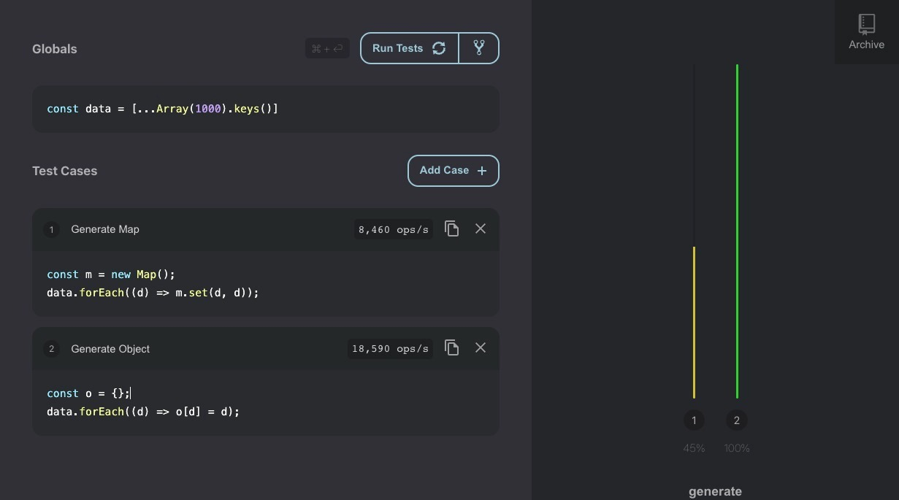

Chrome(V8)

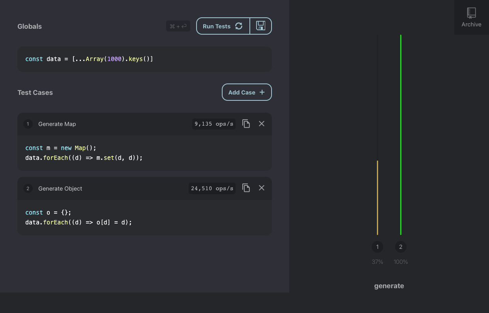

Safari(JSC)

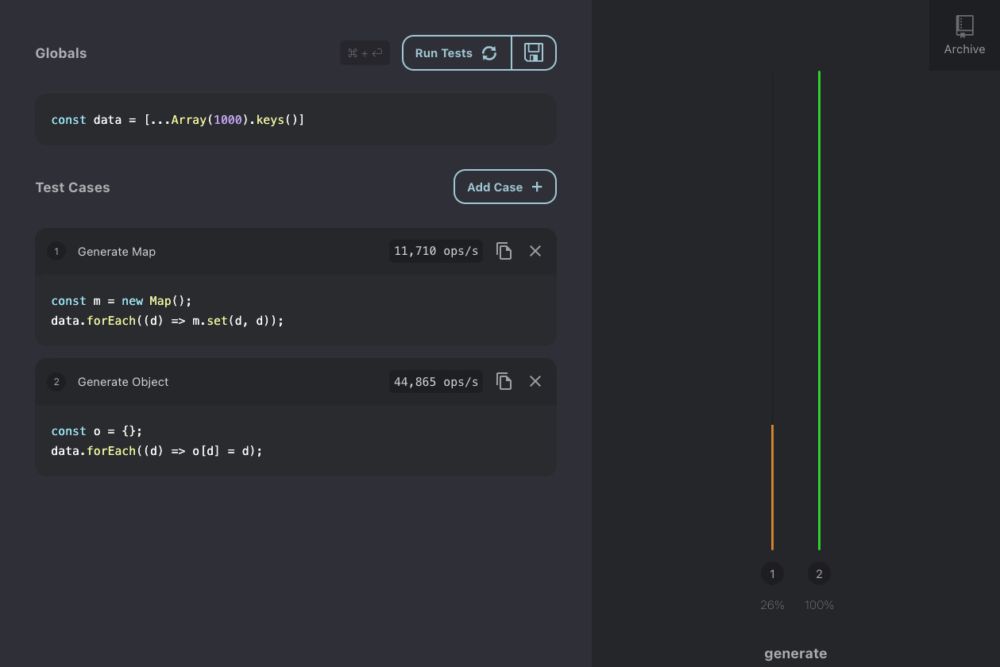

Firefox(SM)

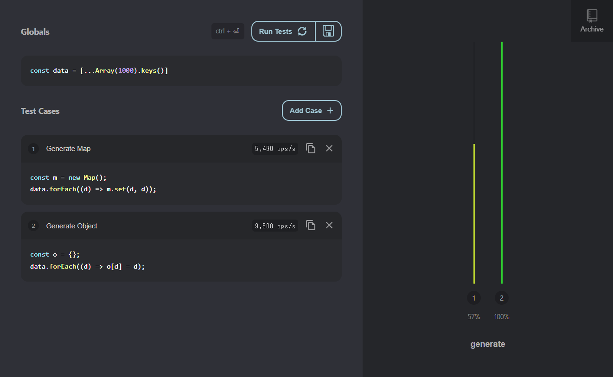

Edge(Chakra)

### 値の取得

`m.get(x)` vs `o[x]`

こちらもいずれのブラウザでも Object の方がやや速い。

（このテストはランダム性があるので何回行ってみた）

[Perflink](https://perf.link/#eyJpZCI6InluamQxbW52MnhhIiwidGl0bGUiOiJnZW5lcmF0ZSIsImJlZm9yZSI6ImNvbnN0IG4gPSAxMDAwXG5jb25zdCBkYXRhID0gWy4uLkFycmF5KG4pLmtleXMoKV07XG5jb25zdCBtID0gbmV3IE1hcCgpO1xuZGF0YS5mb3JFYWNoKChkKSA9PiBtLnNldChkLCBkKSk7XG5jb25zdCBvID0ge307XG5kYXRhLmZvckVhY2goKGQpID0%2BIG9bZF0gPSBkKTtcbmNvbnN0IHJhbmQgPSAoKSA9PiBNYXRoLnJvdW5kKE1hdGgucmFuZG9tKCkgKiBuKTsiLCJ0ZXN0cyI6W3sibmFtZSI6ImdldCB2YWx1ZShtYXApIiwiY29kZSI6Im0uZ2V0KHJhbmQoKSk7IiwicnVucyI6WzI1NjUwMDAsMjQzOTAwMCwxMzM0MDAwLDY4MDAwLDE4NjUwMDAsMjY5NjAwMCwyNzMyMDAwLDIzNjMwMDAsMjc3NzAwMCwzMzMwMDAwLDM3MDAwMDAsNDAzMjAwMCwzMDI2MDAwLDQ3NzAwMDAsNDAxNTAwMCw1ODAwMCwyMjc2MDAwLDQ0MDgwMDAsMTkwOTAwMCw0MzI0MDAwLDQxMDAwMDAsNDQ5NDAwMCwzNDcxMDAwLDIzNjkwMDAsMjcwMDAsMzY2NDAwMCw3MDEwMDAsMzEyMDAwLDM3OTcwMDAsMTA5ODAwMCwzMzQzMDAwLDE2MjUwMDAsMzUwNDAwMCwxNjI5MDAwLDM3OTYwMDAsNDMyNDAwMCwzMjAwMCw4MDYwMDAsNDAzMTAwMCwzMDQ4MDAwLDY1MDAwLDE1NTAwMCwyNTcwMDAsMTQ0ODAwMCwzNTE5MDAwLDQxODMwMDAsNDYxNjAwMCw5OTMwMDAsNDM4MzAwMCw0NjIxMDAwLDIyMjMwMDAsMTk1MDAwLDE4ODkwMDAsNzgwMDAwLDIzNjQwMDAsMzY4MDAwLDMzNjMwMDAsMzY2NDAwMCw0ODAzMDAwLDIzMTAwMCwyMTUzMDAwLDEzMTYwMDAsMzY2NjAwMCwzOTA2MDAwLDMxMjAwMCw0NjIwMDAsMzg1NjAwMCwyOTk2MDAwLDM0MzMwMDAsMTE4NzAwMCwzNDU1MDAwLDMxMjYwMDAsMzY2NDAwMCw0NTE2MDAwLDEzNDYwMDAsMjk1MTAwMCw0MTQ1MDAwLDMyNTIwMDAsMzY2NDAwMCw0NjE4MDAwLDE5ODAwMCw0Njg0MDAwLDM0NTgwMDAsNDEzOTAwMCw0ODIxMDAwLDQyNjkwMDAsMzk1MzAwMCwxMDAwLDM5ODMwMDAsMTc3MDAwMCwxMDQ4MDAwLDQ3ODEwMDAsMzIzNDAwMCwzMzkxMDAwLDQ4MDMwMDAsNDY0MzAwMCw0NTY2MDAwLDQ1OTkwMDAsNDI4ODAwMCw1MDgwMDAwXSwib3BzIjoyNzg3MTEwfSx7Im5hbWUiOiJnZXQgdmFsdWUob2JqZWN0KSIsImNvZGUiOiJvW3JhbmQoKV07IiwicnVucyI6WzI4ODYwMDAsMTY2NjAwMCwxMzg3MDAwLDE4MTEwMDAsMTI4MTAwMCwyNzU3MDAwLDMyMTMwMDAsMjgxMDAwMCwyNTQzMDAwLDM2NjQwMDAsMzE2NzAwMCwzODE3MDAwLDI1ODIwMDAsNTQxMjAwMCw0NDgxMDAwLDMwOTQwMDAsMjgxMjAwMCwxNDMwMDAwLDIzMDkwMDAsNDg2NTAwMCw0OTAxMDAwLDM5NDUwMDAsMzY2NDAwMCwzNjY0MDAwLDE1NjAwMCwzNjY0MDAwLDUxNjIwMDAsMzY0MDAwLDQxOTAwMDAsMTY3MTAwMCwzMjYxMDAwLDIxOTUwMDAsMzg3MDAwMCwxNTAyMDAwLDEwMDQwMDAsNDczODAwMCw1MTExMDAwLDEzMjAwMCw0ODU1MDAwLDMzOTQwMDAsNDE3MDAwLDE4MzAwMCw0NjkzMDAwLDExMTcwMDAsMzgyMTAwMCw0MTkxMDAwLDQ4MzMwMDAsMTYzNjAwMCw0OTIzMDAwLDUyNjAwMDAsMjU1MDAwMCwyNzUwMDAsMTk1NDAwMCwxMDAwMCwzMjE4MDAwLDI3NzAwMCwyODc1MDAwLDM3MTAwMDAsNTQ4MjAwMCw0MzQzMDAwLDIxOTEwMDAsMTk0NTAwMCw0NDM3MDAwLDQxMjIwMDAsNTUwMzAwMCw3ODAwMDAsNDUzODAwMCwzNjY0MDAwLDI3NzUwMDAsNDQ4MDAwLDM5NDMwMDAsMzYzNjAwMCw0MzE0MDAwLDUzMTMwMDAsMTY4MDAwMCwzMTUyMDAwLDQzMDUwMDAsMzY0OTAwMCwzNjYzMDAwLDU0MjQwMDAsOTMwMDAsNDg3OTAwMCwyNzM0MDAwLDQ3ODEwMDAsNDc3NzAwMCw0NDg2MDAwLDQzOTMwMDAsNDg4MDAwMCw3OTAwMDAsMjM5MTAwMCwxMDAwLDU1ODMwMDAsMzY2NDAwMCwzNzMxMDAwLDU3NTAwMDAsNTQ1MTAwMCw1NTA5MDAwLDUzMTQwMDAsNTE1NDAwMCw1ODEwMDAwXSwib3BzIjozMjQ4NTEwfV0sInVwZGF0ZWQiOiIyMDIyLTAzLTI0VDE1OjE2OjAxLjc1NFoifQ%3D%3D)

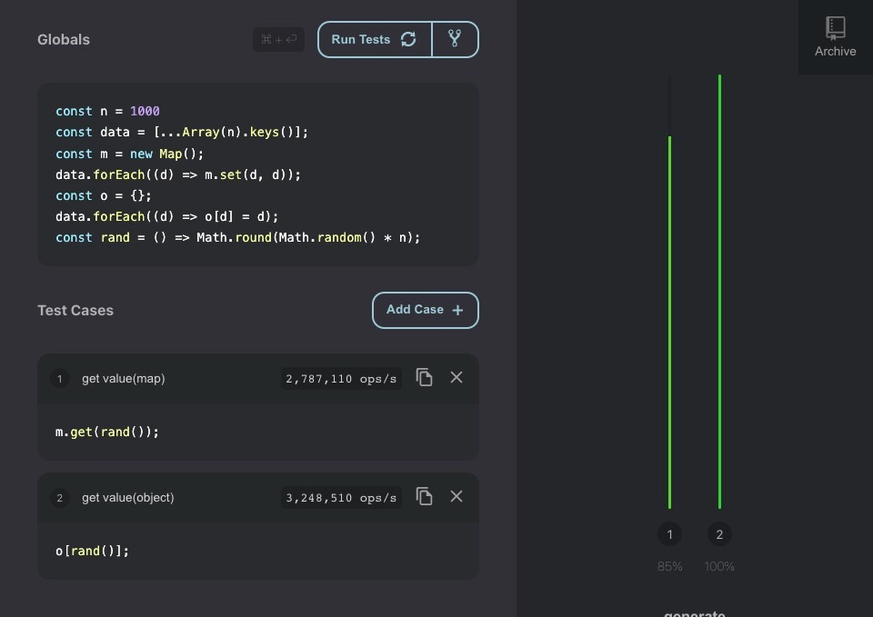

Chrome(V8)

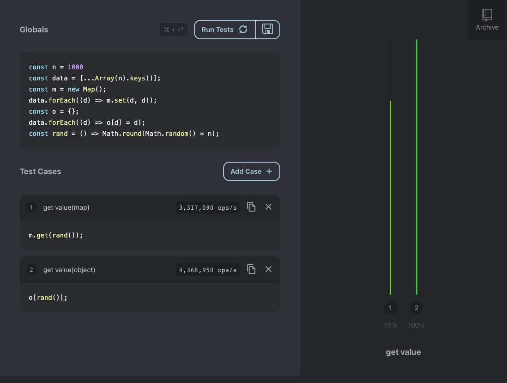

Safari(JSC)

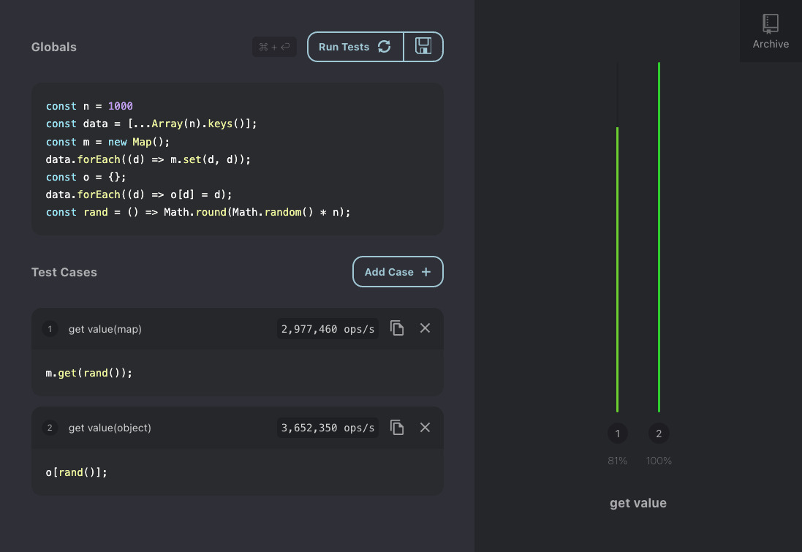

Firefox(SM)

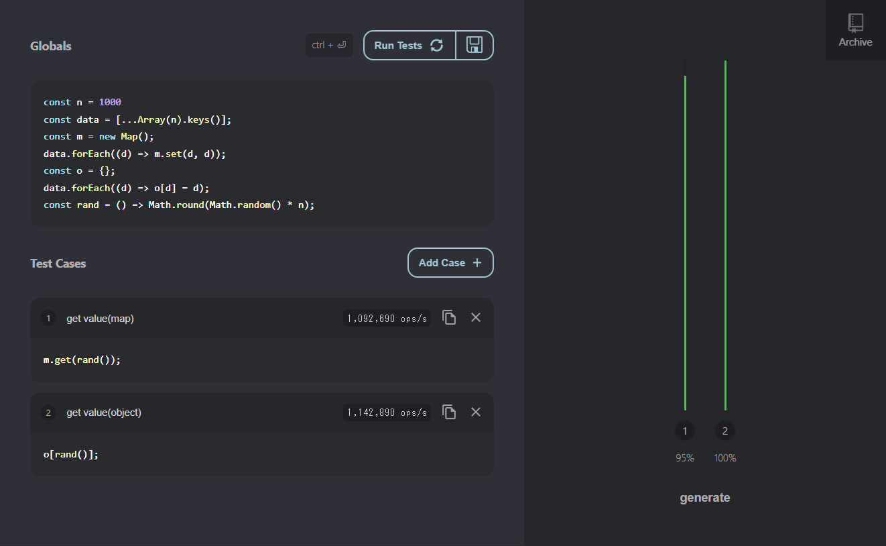

Edge(Chakra)

### 値の削除

`m.delete(x)` vs `delete o[x]`

これは各ブラウザでばらつきがでた。Chrome,Edge だと delete メソッドの方が速いが、Safari だと delete オペレータの方が速い。Firefox はほぼ同じくらいだが map の方がやや速い。

[Perflink](https://perf.link/#eyJpZCI6IjB6ZmY0MW80ejJrIiwidGl0bGUiOiJkZWxldGUgdmFsdWUiLCJiZWZvcmUiOiJjb25zdCBuID0gMTAwMFxuY29uc3QgZGF0YSA9IFsuLi5BcnJheShuKS5rZXlzKCldO1xuY29uc3QgbSA9IG5ldyBNYXAoKTtcbmRhdGEuZm9yRWFjaCgoZCkgPT4gbS5zZXQoZCwgZCkpO1xuY29uc3QgbyA9IHt9O1xuZGF0YS5mb3JFYWNoKChkKSA9PiBvW2RdID0gZCk7IiwidGVzdHMiOlt7Im5hbWUiOiJkZWxldGUgdmFsdWUobWFwKSIsImNvZGUiOiJkYXRhLmZvckVhY2goKGQpID0%2BIG0uZGVsZXRlKGQpKTsiLCJydW5zIjpbMTMwMDAsODAwMCw0MDAwLDEwMDAsMjIwMDAsNDAwMCw3MDAwLDE0MDAwLDE5MDAwLDE0MDAwLDI5MDAwLDExMDAwLDI2MDAwLDIxMDAwLDIwMDAsMTkwMDAsMjAwMDAsMjEwMDAsOTAwMCwyNzAwMCw0MDAwLDIzMDAwLDI2MDAwLDI1MDAwLDI5MDAwLDEwMDAwLDEzMDAwLDI0MDAwLDQwMDAsMTAwMCwyMDAwLDIxMDAwLDcwMDAsMjcwMDAsMjIwMDAsOTAwMCwzNDAwMCwzNTAwMCw0MDAwLDIxMDAwLDE3MDAwLDMyMDAwLDEzMDAwLDIwMDAwLDIwMDAwLDI3MDAwLDIxMDAwLDE4MDAwLDQwMDAwLDI5MDAwLDI0MDAwLDIwMDAwLDIyMDAwLDE5MDAwLDI1MDAwLDgwMDAsNDEwMDAsMjAwMDAsOTAwMCwxMDAwLDE1MDAwLDI0MDAwLDEzMDAwLDIxMDAwLDIxMDAwLDI2MDAwLDIyMDAwLDE0MDAwLDE2MDAwLDUwMDAsMTgwMDAsMTQwMDAsMTAwMCwxMDAwLDE3MDAwLDE4MDAwLDEzMDAwLDE3MDAwLDE3MDAwLDUwMDAsMTYwMDAsMjMwMDAsMzIwMDAsMzMwMDAsMTAwMCwyMDAwLDEwMDAwLDIwMDAsMTgwMDAsMjEwMDAsMjEwMDAsMTIwMDAsMTAwMCwyNDAwMCwzMTAwMCw0MjAwMCwxMDAwLDIzMDAwLDEwMDAsMTgwMDBdLCJvcHMiOjE2ODgwfSx7Im5hbWUiOiJkZWxldGUgdmFsdWUob2JqZWN0KSIsImNvZGUiOiJkYXRhLmZvckVhY2goKGQpID0%2BIGRlbGV0ZSBvW2RdKTsiLCJydW5zIjpbNTAwMCw3MDAwLDIwMDAsMTIwMDAsMTQwMDAsMjAwMCwyMDAwLDYwMDAsMTIwMDAsOTAwMCwxNDAwMCw3MDAwLDkwMDAsMTMwMDAsMTAwMCwxMjAwMCwxMTAwMCwxMzAwMCw1MDAwLDE0MDAwLDMwMDAsMTQwMDAsMTYwMDAsMTYwMDAsMTcwMDAsNjAwMCw3MDAwLDEyMDAwLDMwMDAsMTgwMDAsMjAwMCwxMzAwMCw2MDAwLDE2MDAwLDE0MDAwLDUwMDAsMTcwMDAsMjAwMCwyMDAwLDE0MDAwLDExMDAwLDE3MDAwLDcwMDAsMTIwMDAsMTMwMDAsMTcwMDAsMTQwMDAsMTIwMDAsMTgwMDAsMTcwMDAsMTIwMDAsMTMwMDAsMTMwMDAsMTEwMDAsMTUwMDAsNTAwMCwyMTAwMCwxMTAwMCwzMDAwLDEwMDAsODAwMCwxNTAwMCw2MDAwLDExMDAwLDE0MDAwLDcwMDAsMTYwMDAsNTAwMCwxMDAwMCwxMzAwMCwxMTAwMCwxMTAwMCwxMDAwLDgwMDAsMTEwMDAsMTEwMDAsNzAwMCwxODAwMCw5MDAwLDE0MDAwLDExMDAwLDE0MDAwLDE3MDAwLDE0MDAwLDEwMDAsMTUwMDAsNzAwMCwyMDAwLDEwMDAwLDEzMDAwLDE0MDAwLDUwMDAsMTYwMDAsMTEwMDAsMTcwMDAsMTgwMDAsMTgwMDAsMTQwMDAsMTAwMCw5MDAwXSwib3BzIjoxMDQ5MH1dLCJ1cGRhdGVkIjoiMjAyMi0wMy0yNFQxNToyMzoyMi41NDNaIn0%3D)

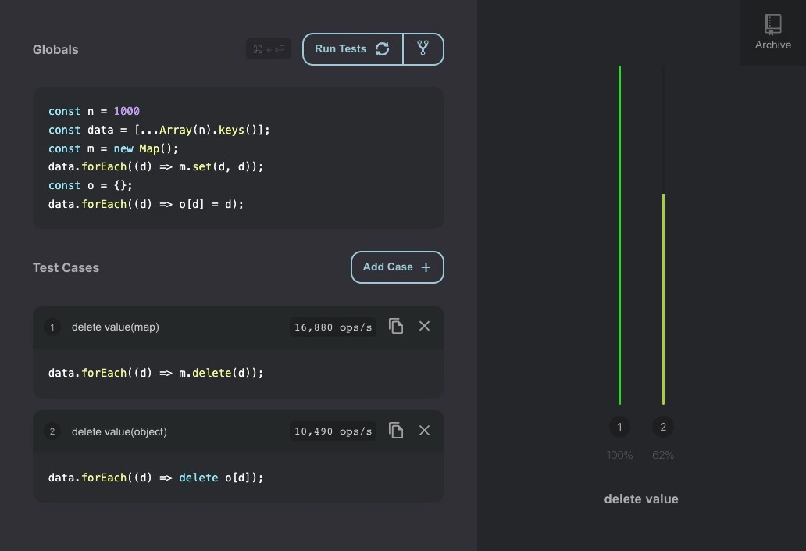

Chrome(V8)

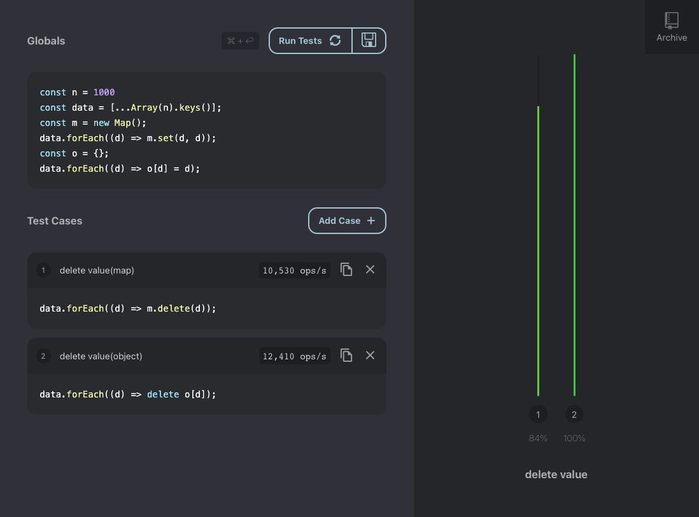

Safari(JSC)

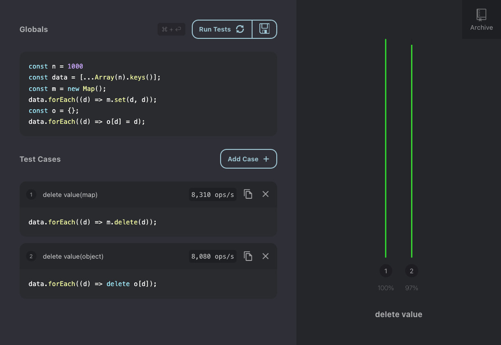

Firefox(SM)

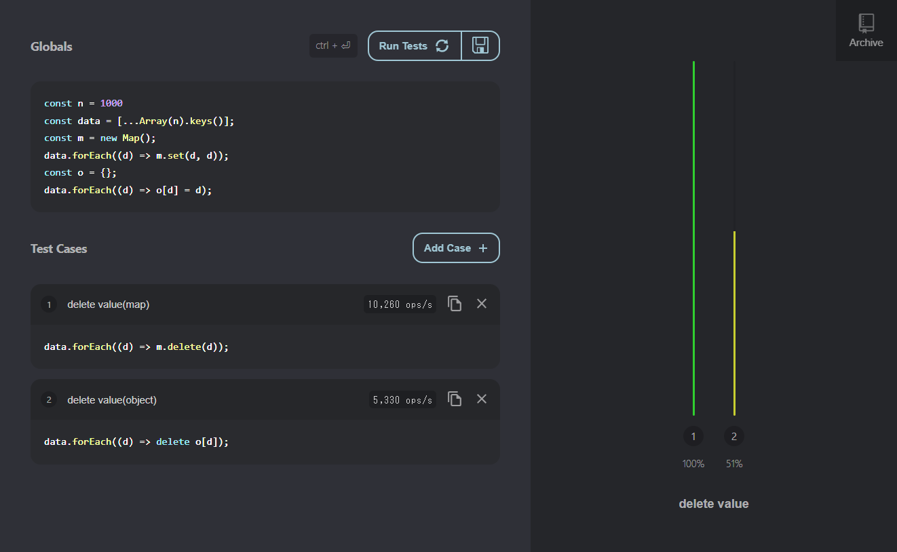

Edge(Chakra)

### 走査

これはいくつかの操作のパターンを試してみた。

```js
// 1. Map: for of パターン
for (const [k, v] of m) {
  sum += v;
}

// 2. Map: forEachメソッドパターン
m.forEach((v, k) => {
  sum += v;
});

// 3. Map: 配列に変換し、ArrayのforEachを使うパターン
[...m].forEach(([k, v]) => {
  sum += v;
});

// 4. Map: 配列に変換し、for文を使うパターン
let sum = 0;
const _m = [...m];
const len = _m.length;
for (let i = 0; i < len; i++) {
  sum += _m[i][1];
}

// 5. Object: Object.entriesでfor..ofを使うパターン
for (const [k, v] of Object.entries(o)) {
  sum += v;
}

// 6. Object: Object.values で for..ofを使うパターン
for (const v of Object.values(o)) {
  sum += v;
}

// 7. Object: Object.keys で for..ofを使うパターン
for (const k of Object.keys(o)) {
  sum += k;
}

// 8. Object: Object.values で ArrayのforEachを使うパターン
Object.values(o).forEach((v) => (sum += v));

// 9. Object: Object.values で for文を使うパターン
const vas = Object.values(o);
const len = vas.length;
for (let i = 0; i < len; i++) {
  sum += vas[i];
}

// 10. Object: for..inのパターン
for (const k in o) {
  if (o.hasOwnProperty(k)) {
    sum += o[k];
  }
}
```

- Chorme と Firefox,Edge はほぼ同じような結果になり、Safari は結構違う結果になった。
- value のみを利用したい場合は 9 の `Object.values` で変換し、昔ながらの for 文を使って走査するのが速い。
- 次点で `for(const v of Object.values(o))`
- map ではネイティブのメソッドである `forEach` がどのブラウザでも速かった。
- Safari では map の forEach が圧倒的に早く、他の map, object の走査はどれも遅かった。
  - map の forEach 以外だと、Object の `for..in` が次点で速かった。

結論としては、走査の書き方によって処理速度が顕著に変わる、map の場合は `forEach` 一択である。Object の場合は value 限定であれば、通常の for 文を利用するが一番速いが、バランスを取って `for(const v of Object.values(o)){}` でもよいと思われる。

[Perflink リンク](https://perf.link/#eyJpZCI6IjVjbXkxYmMwYXI0IiwidGl0bGUiOiJ0cmF2ZXJzZSIsImJlZm9yZSI6ImNvbnN0IG4gPSAxMDAwO1xuY29uc3QgZGF0YSA9IFsuLi5BcnJheShuKS5rZXlzKCldO1xuY29uc3QgbSA9IG5ldyBNYXAoKTtcbmRhdGEuZm9yRWFjaCgoZCkgPT4gbS5zZXQoZCwgZCkpO1xuY29uc3QgbyA9IHt9O1xuZGF0YS5mb3JFYWNoKChkKSA9PiBvW2RdID0gZCk7IiwidGVzdHMiOlt7Im5hbWUiOiJtYXA6IGZvci4ub2YiLCJjb2RlIjoibGV0IHN1bSA9IDBcbmZvcihjb25zdCBbaywgdl0gb2YgbSl7IHN1bSArPSB2OyB9IiwicnVucyI6WzEwMDAsMTI4NSwxMDAwLDEwMDAsNjAwMCwxMjg1LDEyODUsMTQ1NzEsMTU1NzEsNTU3MSwxMjg1LDEyODU3LDEyODUsMTkxNDIsMTAwMDAsMTAwMDAsNTU3MSw1NTcxLDU1NzEsNjI4NSwxMDAwMCwxMDAwLDY1NzEsMTM1NzEsMTI4NSwxMjg1LDU0MjgsOTQyOCwxMDAwLDE5MTQyLDU1NzEsNTU3MSwxMjg1LDEyODUsMTI4NSwxMjg1LDU1NzEsMTAwMCwxNDcxNCw1NDI4LDc0MjgsMTQ1NzEsNTU3MSw1NTcxLDU1NzEsMTQ1NzEsMTQ1NzEsMTAwMDAsNTU3MSwxMjg1LDE0NDI4LDM0MjgsNTU3MSw0MTQyLDQ3MTQsMTAwMDAsMTM4NTcsMTI4NSwxMjg1LDU1NzEsMTkxNDIsMTM4NTcsMTQ1NzEsMTI4NSw1NTcxLDU1NzEsMTI4NSwxMzcxNCwxNDU3MSwxMDAwMCwxMjg1LDU4NTcsMTI4NSwxMjg1LDU1NzEsNTU3MSwxMDAwMCw1NTcxLDEwMDAsMTAwMCwxMjg1LDEwMDAwLDEyODUsMTQ1NzEsNTU3MSwxMjg1LDEwMDAsNTU3MSw3NzE0LDU1NzEsMTI4NSwxMjg1LDE0NTcxLDEwODU3LDE5MTQyLDU1NzEsODE0Miw1NTcxLDM3MTQyLDIwNzE0XSwib3BzIjo3MDI5fSx7Im5hbWUiOiJtYXA6IGZvckVhY2giLCJjb2RlIjoibGV0IHN1bSA9IDA7XG5tLmZvckVhY2goKHYsIGspID0%2BIHsgc3VtICs9IHY7IH0pOyIsInJ1bnMiOls5NTg1Nyw3NzE0Miw3MTg1Nyw2NjE0Miw3MzcxNCw1OTI4NSwxMTAwMDAsNjk3MTQsOTQxNDIsNzAwMDAsMTA1NzE0LDEwMzQyOCw5NTQyOCw4NDI4NSw3MTQyOCw1NjcxNCw4MTE0Miw0MDI4NSw1MTU3MSw1NjQyOCw1NzAwMCw2OTcxNCw5NTE0Miw3MzE0Miw2NTQyOCw1NjU3MSw4MTcxNCw3Nzg1Nyw4NTcxNCw5MzI4NSw3MDAwMCwxMDM3MTQsNzc1NzEsNjgxNDIsNzAwMDAsNzIwMDAsNDE1NzEsNDcyODUsNzUwMDAsODYwMDAsMTA0NTcxLDExNDQyOCw4MzcxNCw3MjU3MSw4OTI4NSw1OTE0Miw3MTAwMCw1NzE0Miw2NjQyOCw2MTg1Nyw1MjAwMCwxMDIyODUsNTMyODUsNjc4NTcsMTAxMjg1LDY4Mjg1LDk1NTcxLDczNTcxLDEwMTE0Miw4NTg1Nyw2NjQyOCw5MjI4NSw2NjI4NSw4MjI4NSw0MDg1Nyw2ODU3MSw3NTg1Nyw3NDAwMCw1NjAwMCw0OTcxNCw1NTcxNCw3NjQyOCw5MTAwMCw3MDI4NSw0MTI4NSw2ODAwMCw5NDI4NSw3NDQyOCw3NzQyOCw1NDQyOCw1ODg1Nyw2MTcxNCw1MzAwMCw5NzU3MSw3ODAwMCw4NzE0Miw4MTAwMCw5MTU3MSw2NjcxNCw3MTg1Nyw0OTcxNCw3ODQyOCw3MDAwMCw1Njg1Nyw3NjQyOCw0MjU3MSw3OTQyOCw1NzU3MSw3Njg1NywxMDg0MjhdLCJvcHMiOjc0MDE2fSx7Im5hbWUiOiJtYXA6IHRvIGFycmF5ICYgZm9yRWFjaCIsImNvZGUiOiJsZXQgc3VtID0gMDtcblsuLi5tXS5mb3JFYWNoKChbaywgdl0pID0%2BIHsgc3VtICs9diB9KTsiLCJydW5zIjpbNDU3MSwxODU3LDI0MjgsMTg1NywzMjg1LDIwMDAsMjAwMCw0NzE0LDM1NzEsMjAwMCw0NDI4LDEwMTQyLDc0MjgsNTcxNCw0MDAwLDI1NzEsMTg1NywyNzE0LDQ1NzEsMzAwMCwyMDAwLDIxNDIsMzE0Miw1NTcxLDI0MjgsMzQyOCwyMDAwLDQ1NzEsNDAwMCwzMDAwLDUwMDAsMzAwMCw1MDAwLDU0MjgsMTAwMCwzMjg1LDI4NTcsMjcxNCw1MTQyLDUwMDAsNDE0Miw0NzE0LDQwMDAsMTg1NywyMTQyLDE1NzEsMzAwMCwzODU3LDEwMDAsMzU3MSw0MDAwLDUwMDAsMTQyOCwzMDAwLDMwMDAsMjAwMCwyMDAwLDIwMDAsNDAwMCwxMjg1LDMxNDIsMzAwMCwyMjg1LDEyODUsNDAwMCw1NzE0LDI4NTcsNDcxNCwyODU3LDI0MjgsNDAwMCwzMDAwLDM0MjgsNDg1NywyNzE0LDU0MjgsMjAwMCw0MDAwLDYwMDAsMzQyOCw1Mjg1LDE4NTcsMjU3MSw0ODU3LDQ4NTcsMTI4NSw1NzEsMjAwMCwyMDAwLDMwMDAsMzAwMCwyMDAwLDE4NTcsMjI4NSwyNDI4LDMwMDAsNjQyOCwzMDAwLDY0MjgsNTg1N10sIm9wcyI6MzM4Nn0seyJuYW1lIjoibWFwOiBhcnJheSBmb3IgbG9vcCIsImNvZGUiOiJsZXQgc3VtID0gMDtcbmNvbnN0IF9tID0gWy4uLm1dLm1hcCgodikgPT4gdlsxXSk7XG5jb25zdCBsZW4gPSBfbS5sZW5ndGg7XG5mb3IobGV0IGkgPSAwO2kgPCBsZW47IGkrKyl7IHN1bSArPSBfbVtpXTsgfSIsInJ1bnMiOlszODU3LDMwMDAsMzAwMCwzNzE0LDMwMDAsMzAwMCwzMDAwLDMwMDAsMzAwMCwzMDAwLDU4NTcsNTg1Nyw1NTcxLDUxNDIsNDE0MiwzMDAwLDMwMDAsMzAwMCwzMDAwLDMwMDAsMzAwMCwzNTcxLDMwMDAsNTQyOCwzMDAwLDMwMDAsMzE0MiwzMDAwLDMwMDAsMzAwMCwzNTcxLDMwMDAsMzAwMCwzMDAwLDMwMDAsNDAwMCwzNTcxLDU0MjgsMzAwMCwzNTcxLDU0MjgsNTg1NywzMDAwLDM1NzEsNDE0MiwzMDAwLDM1NzEsMzg1NywzNTcxLDM0MjgsMzAwMCwzNTcxLDM1NzEsMzAwMCwzMDAwLDMwMDAsMzAwMCwzNTcxLDMwMDAsMzU3MSwzMDAwLDMwMDAsMzE0MiwzMDAwLDMwMDAsMzU3MSwzMDAwLDM3MTQsMzAwMCwzNTcxLDM1NzEsMzAwMCwzMDAwLDM0MjgsMzU3MSwzNTcxLDM1NzEsMzI4NSwzMDAwLDMwMDAsMzU3MSwzMDAwLDM1NzEsMzQyOCwzNTcxLDMwMDAsMTcxNCwzMDAwLDUwMDAsMzAwMCwzNTcxLDMwMDAsMzAwMCwzMDAwLDMwMDAsNTQyOCwzMDAwLDMwMDAsMzAwMCw1NDI4XSwib3BzIjozNDY0fSx7Im5hbWUiOiJvYmplY3Q6IGZvciBvZiAoZW50aXJlcykiLCJjb2RlIjoibGV0IHN1bSA9IDA7XG5mb3IoY29uc3QgW2ssIHZdIG9mIE9iamVjdC5lbnRyaWVzKG8pKXsgc3VtICs9IHYgfSIsInJ1bnMiOlsxMTQyLDExNDIsMTE0MiwxMTQyLDExNDIsMTE0MiwxMTQyLDI4NTcsMzAwMCw0NDI4LDExNDIsMTYxNDIsNDQyOCw0NTcxLDQxNDIsMTE0Miw0MDAwLDM4NTcsNDQyOCw0NDI4LDExNDIsMTE0Miw0MDAwLDQ3MTQsMTE0Miw0Mjg1LDQ0MjgsMTE0MiwxMTQyLDgyODUsNDQyOCw0NDI4LDIwMDAsMTE0Miw0MDAwLDExNDIsMjcxNCwxMTQyLDQwMDAsMjU3MSwxMTI4NSwxMjE0MiwxMTQyLDExNDIsMTE0MiwxMjg1LDQ0MjgsMTE0MiwxMTQyLDQ0MjgsMTE0MiwxMTQyLDExNDIsNDQyOCw0NDI4LDExNDIsMTE0Miw0NDI4LDM4NTcsMjcxNCwxMTQyLDExNDIsNDQyOCwxMTQyLDQ0MjgsNDQyOCwxMTQyLDExNDIsMTE0MiwxMTQyLDExNDIsMjE0Miw1NDI4LDM3MTQsMTU3MSwxMTQyLDExNDIsMTE0MiwyNDI4LDcwMDAsNTE0Miw3Mjg1LDExNDIsMTE0MiwxMTQyLDExNDIsMTE0Miw0NDI4LDExNDIsMTE0Miw0NDI4LDExNDIsMTE0MiwxMTQyLDQ0MjgsODAwMCwxMTQyLDQ0MjgsMTE1NzEsNDU3MV0sIm9wcyI6MzA1M30seyJuYW1lIjoib2JqZWN0OiBmb3Igb2YgKHZhbHVlcykiLCJjb2RlIjoibGV0IHN1bSA9IDA7XG5mb3IoY29uc3QgdiBvZiBPYmplY3QudmFsdWVzKG8pKXsgc3VtICs9IHYgfSIsInJ1bnMiOlsxODU3LDE4NTcsMTg1Nyw1NTI4NSw1MzcxNCw2OTE0Miw0MTcxNCwxNjQyOCw0MTU3MSw2OTU3MSw0MTcxNCwxMjQwMDAsMTE5MTQyLDM3MDAwLDY4MTQyLDY5MTQyLDY5MTQyLDU5Mjg1LDU5NzE0LDE4NTcsNjkxNDIsNDA3MTQsNTQyODUsMzQ1NzEsNDU3MTQsMjQyODUsMzU3MTQsOTY1NzEsNDI4NTcsNDE3MTQsNDkwMDAsNDgyODUsNjQ4NTcsNTYxNDIsNDE3MTQsNDE3MTQsNjkxNDIsODcwMDAsMTE4NTcsNzIyODUsMTAwMTQyLDYzMTQyLDEyMDQyOCw2OTE0Miw2ODI4NSw0MTcxNCw2OTI4NSw0NjE0Miw5NjU3MSw2OTE0Miw0MTcxNCw0MTcxNCwxNzcxNCwzMTcxNCw3MDI4NSw2NjU3MSw2OTE0MiwxNjQyOCw0MTcxNCw0MTcxNCwxNjQyOCw4Mjg1Nyw2OTE0Miw5NjU3MSw0MTcxNCw0NDcxNCwzMDE0MiwzODg1Nyw2OTE0Miw0MjE0Miw2OTE0Miw2OTE0Miw5MzI4NSw0MTcxNCw0MTcxNCw0MTcxNCw2OTE0Miw0MTcxNCwzNDg1Nyw2MTU3MSw4NDI4NSw2OTE0Miw2OTE0Miw0MTcxNCw0MTcxNCw1NzAwMCwxNjQyOCw0MTcxNCw2OTE0Miw1MDg1Nyw3ODI4NSw5NzcxNCwyODg1Nyw0MTcxNCw0MDE0Miw0MTcxNCw0MTcxNCw3MDE0MiwxMjQwMDAsNDE3MTRdLCJvcHMiOjU0NTUyfSx7Im5hbWUiOiJvYmplY3Q6IGZvciBvZiAoa2V5cykiLCJjb2RlIjoibGV0IHN1bSA9IDA7XG5mb3IoY29uc3QgayBvZiBPYmplY3Qua2V5cyhvKSl7IHN1bSArPSBrIH0iLCJydW5zIjpbMTg1Nyw4NzE0LDg1NzEsMjU4NTcsODcxNCw4NTcxLDM0MjgsNzg1Nyw4NTcxLDIwMTQyLDE1ODU3LDI5ODU3LDE4MTQyLDEyNzE0LDc3MTQsODcxNCwxNDQyOCw4NzE0LDE2Mjg1LDE2NTcxLDEwODU3LDM0MjgsOTE0Miw4NzE0LDQxNDIsMzQyOCwzMTQyLDE0NDI4LDcyODUsMTY1NzEsMTQ0MjgsODcxNCwxNDQyOCwxMTcxNCw4MDAwLDY4NTcsMTQ0MjgsMjE3MTQsMTE4NTcsMjUyODUsMTM3MTQsMjQ1NzEsMTEyODUsMTQ0MjgsODcxNCw4NzE0LDg3MTQsODcxNCw4NDI4LDExNTcxLDYwMDAsMTQ0MjgsMjAxNDIsMTM1NzEsMTA0MjgsMTQyODUsMzQyOCw4NzE0LDIwMTQyLDg3MTQsMTQyODUsMTcyODUsMzQyOCwyMDI4NSw4NzE0LDE0NDI4LDg3MTQsODcxNCwxMjg1Nyw4NzE0LDE0MTQyLDEzMTQyLDM0MjgsMTA0MjgsMTQ0MjgsOTg1Nyw0NzE0LDE0NDI4LDM0MjgsOTg1NywxMzAwMCw1MTQyLDY3MTQsMjUxNDIsODcxNCwzNTcxLDE4NTcsNzcxNCw1NzE0LDE0NDI4LDg3MTQsMTU1NzEsMjQ1NzEsODU3MSwyNTg1NywxMzg1NywxMjQyOCwxMTQyOCwyNDU3MSw4NzE0XSwib3BzIjoxMTcwMH0seyJuYW1lIjoib2JqZWN0OiBPYmplY3QudmFsdWVzICYgZm9yRWFjaCIsImNvZGUiOiJsZXQgc3VtID0gMDtcbk9iamVjdC52YWx1ZXMobykuZm9yRWFjaCgodikgPT4gc3VtICs9IHYgKSIsInJ1bnMiOlszNDQyOCwzNDE0Miw0ODcxNCwzMTg1Nyw2MjQyOCw0ODcxNCw3NjE0MiwzNzI4NSw0MzU3MSwzMjE0MiwzMjI4NSw1NTE0Miw1Mzg1Nyw1OTQyOCw2MjI4NSw2MDAwMCw0ODcxNCw1MTI4NSwyMzQyOCw1NDAwMCw2MDcxNCw3NDE0MiwzNTAwMCw3Nzg1NywzNjQyOCw1MzI4NSw0ODI4NSw1OTI4NSwzMjg1NywzNzAwMCwzMDI4NSw0NDcxNCw0OTQyOCw0NDI4NSwzMzI4NSw0NzAwMCw0OTAwMCw0ODcxNCw1NzcxNCw1NTAwMCw2Mzg1Nyw2NjI4NSwyOTE0Miw0ODcxNCw2NDE0MiwzNDAwMCw0MjcxNCwyODg1Nyw2NTQyOCw0NDAwMCw0MzcxNCw2NzAwMCw1MTE0Miw0ODcxNCwzMzE0Miw0NzU3MSw3OTI4NSw1NzQyOCw0ODcxNCw1MDg1Nyw2MzI4NSw0ODg1Nyw0ODcxNCw1NjcxNCwzNTcxNCw0ODI4NSw0MDAwMCwzOTcxNCw2MzI4NSw1NTcxNCw0ODU3MSwzNDE0Miw1NjI4NSw0ODcxNCw0ODcxNCw0OTU3MSw1MTg1Nyw0NTQyOCw2MzI4NSw0ODcxNCw0MDcxNCwzMzU3MSw0ODg1Nyw1Mzg1Nyw0ODcxNCw0Njg1Nyw0ODcxNCw1MjQyOCw0NzcxNCw2ODAwMCw0NTcxNCwzNzg1Nyw2Mjg1Nyw0NjU3MSwyNjg1NywzNTU3MSwzODg1Nyw0NTg1Nyw3MDcxNCw2MTU3MV0sIm9wcyI6NDg5NjJ9LHsibmFtZSI6Im9iamVjdDogT2JqZWN0LnZhbHVlcyAmIGZvciBsb29wIiwiY29kZSI6ImxldCBzdW0gPSAwO1xuY29uc3QgdmFzID0gT2JqZWN0LnZhbHVlcyhvKTtcbmNvbnN0IGxlbiA9IHZhcy5sZW5ndGg7XG5mb3IobGV0IGkgPSAwOyBpIDwgbGVuOyBpKyspeyBzdW0gKz0gdmFzW2ldIH0iLCJydW5zIjpbNjU1NzEsNTI1NzEsMjM0MjgsMTM2ODU3LDEwNDE0Miw0ODcxNCwxMTk0MjgsODY1NzEsMTQ2MTQyLDEzMTAwMCw3NjI4NSwxNTY1NzEsMTMwMTQyLDE2ODU3MSwxNTcyODUsMTMxMDAwLDE3ODAwMCwxMzE3MTQsMTUyMDAwLDE0MTg1NywxMzE3MTQsMTQ3Mjg1LDkzMDAwLDE4MjQyOCw0OTAwMCw3NjE0Miw0ODcxNCw2MzI4NSwxNjc3MTQsMTQ1NDI4LDEzNzQyOCw3NjE0MiwxOTU4NTcsMTE2Mjg1LDEwMzU3MSwyNTI4NSw0ODcxNCwxNjg1NzEsMTk3NDI4LDE4MTAwMCw2ODg1NywxODc3MTQsNDg3MTQsMTE4ODU3LDIwMDg1Nyw5MzAwMCwxNzI3MTQsNzMwMDAsOTgwMDAsNDg3MTQsNzYxNDIsMTM0NDI4LDEyNDQyOCwxNzIxNDIsNTU0MjgsMTI4Mjg1LDEyNjI4NSw4NDI4NSwxMjIyODUsNzE0MjgsMTAzNTcxLDcxNzE0LDEyNzQyOCwyMTU1NzEsMTI2MTQyLDE5MzI4NSwxMzk3MTQsMTE5Mjg1LDE0NTE0MiwxMzEwMDAsMTAzNTcxLDQ4NzE0LDc2MTQyLDk0NTcxLDEwMjcxNCwyMDk4NTcsNDkxNDIsMTAzNTcxLDE0NjcxNCwxMTgwMDAsMjAxMTQyLDc2MTQyLDQ4NzE0LDE5NjAwMCw3NjE0MiwxMjU4NTcsOTc1NzEsMTE1MDAwLDEwMzg1Nyw0ODcxNCwxOTgxNDIsODI3MTQsMTA1MTQyLDk1Mjg1LDE0OTU3MSw3NjE0MiwxMzEwMDAsMTMxMDAwLDEzNjQyOCwxOTExNDJdLCJvcHMiOjExNzA5OX0seyJuYW1lIjoib2JqZWN0OiBmb3IgaW4iLCJjb2RlIjoibGV0IHN1bSA9IDA7XG5mb3IoY29uc3QgayBpbiBvKXsgaWYoby5oYXNPd25Qcm9wZXJ0eShrKSl7c3VtICs9IG9ba119IH0iLCJydW5zIjpbMTYyODUsMTMwMDAsMTgxNDIsMTM1NzEsMTMxNDIsMjAwMCwyMDcxNCwxNzI4NSwxNDg1NywxMzAwMCw2MTQyLDE1Mjg1LDIzODU3LDE0NzE0LDE4MTQyLDEyMjg1LDIwODU3LDEyNzE0LDE2ODU3LDE0NDI4LDEyMDAwLDIzODU3LDE2MTQyLDIzNDI4LDE0ODU3LDExNDI4LDE5NzE0LDIwMDAwLDIwNTcxLDE1MDAwLDIzMjg1LDE3MTQyLDE1ODU3LDIwNTcxLDIzNDI4LDIyMjg1LDE5ODU3LDE2NTcxLDE2ODU3LDIwNDI4LDE4MTQyLDE3MTQyLDE2ODU3LDE5MDAwLDI0MTQyLDEwNzE0LDE2NzE0LDIwMTQyLDE3NzE0LDE4MTQyLDE4ODU3LDI0MDAwLDE2Mjg1LDE3Mjg1LDIxNDI4LDE2NTcxLDIxNDI4LDIwODU3LDE3MDAwLDE2ODU3LDkyODUsMTcxNDIsMjEyODUsMjExNDIsMjA0MjgsMTU4NTcsMTc3MTQsMTI1NzEsMjEyODUsMTEyODUsMTM1NzEsMjAyODUsMTc1NzEsMTQ0MjgsMjIwMDAsMjMyODUsMjAxNDIsMTk3MTQsMTcxNDIsMTQxNDIsMTc4NTcsMTc3MTQsMTQwMDAsMjI3MTQsNzI4NSwyMzg1NywxODQyOCwxMzg1NywxMTE0MiwxMTQyOCwyOTcxNCwxNTcxNCwxNzE0MiwxNzU3MSwxNzU3MSwxNTI4NSwxNDQyOCwyNTQyOCwxNDU3MSwyMjU3MV0sIm9wcyI6MTczODN9XSwidXBkYXRlZCI6IjIwMjItMDMtMjRUMTY6MjI6NDAuMTU2WiJ9)

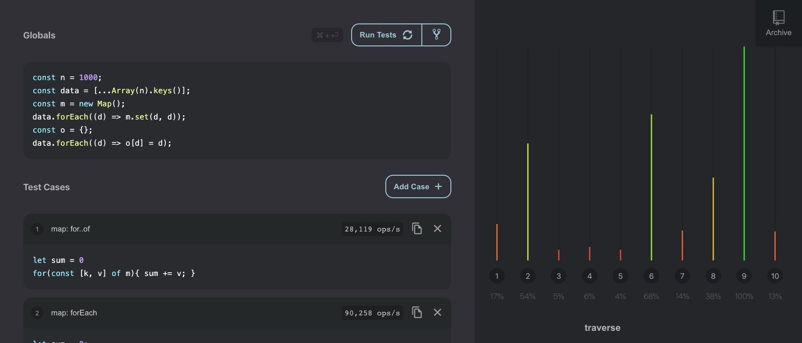

Chrome(V8)

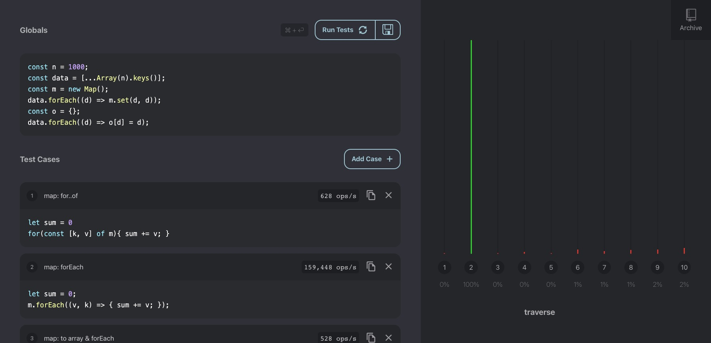

Safari: map の forEach だけが異常に速く、それ以外はだいぶ遅い

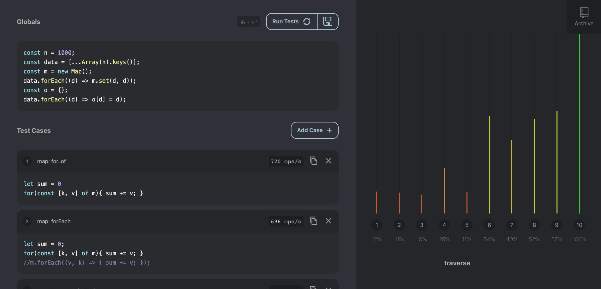

Safari で map の forEach を除いた場合は、for..in が速かった

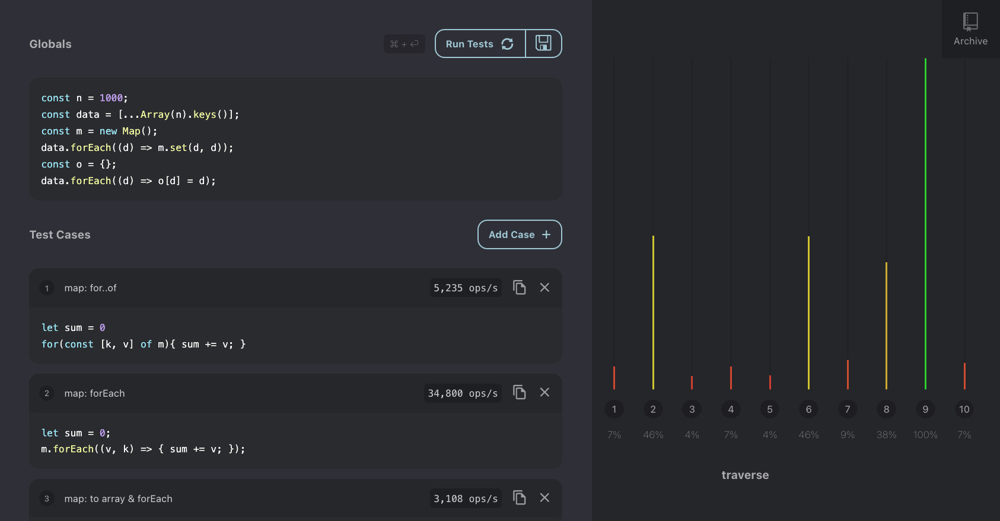

Firefox(SM): おおよそ Chrome と同じ

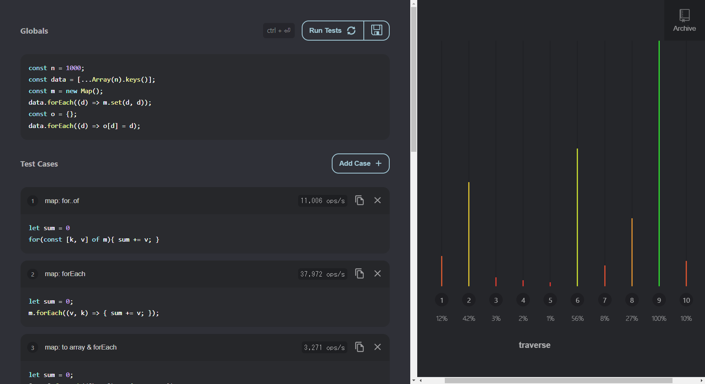

Edge(Chakra): こちらも Chrome, Firefox とおおよそ同じ

## まとめ

Object と Map は同じ使い方ができるが、Map を使う場合の指標としては以下の点が上げられる

- キーに文字列(または Symbol)以外を指定したい場合は Map 一択となる
- プロパティの追加、削除が頻発する場合は、Map の方がパフォーマンスが上がる。
- 走査する場合、 `Object.keys` や `Object.values` を使わずに走査できるので、可読性が上がり、処理速度も速い。
- Object の要素数や空の判定も、もともと効率的な書き方ができなかったので、 `size`メソッドによる恩恵も大きいと思う

JavaScript はもともと辞書型を定義するものが Object しかなかったので、仕方なくそれを使っていた面もあるので、機会（と要件）が合うのであれば積極的に Map も使って行きたい所である。
