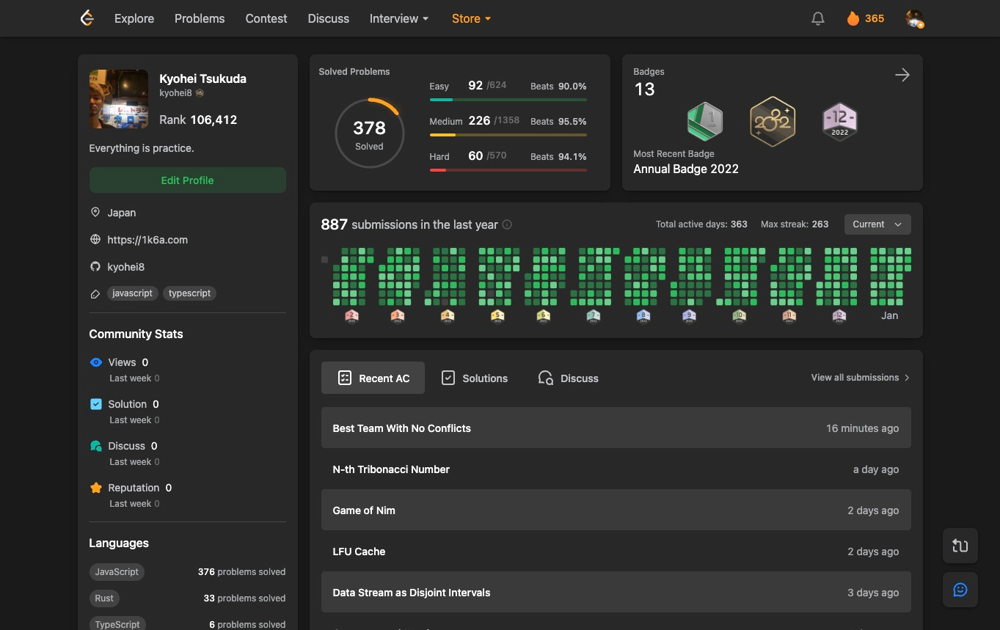
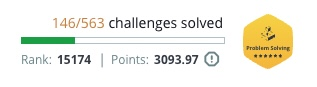
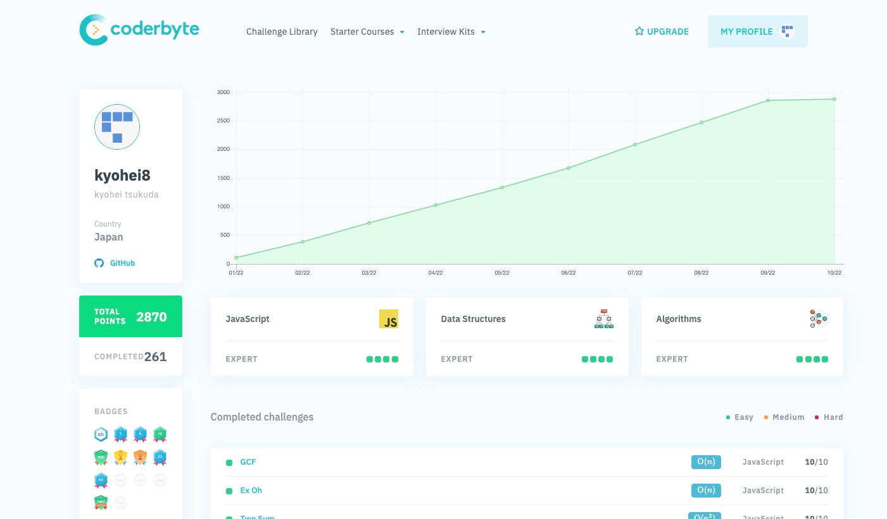
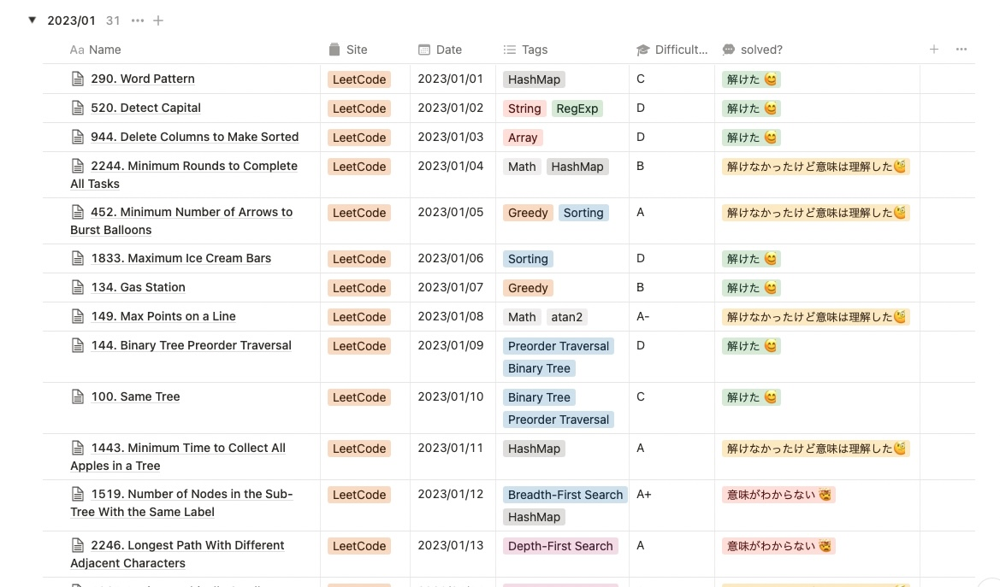
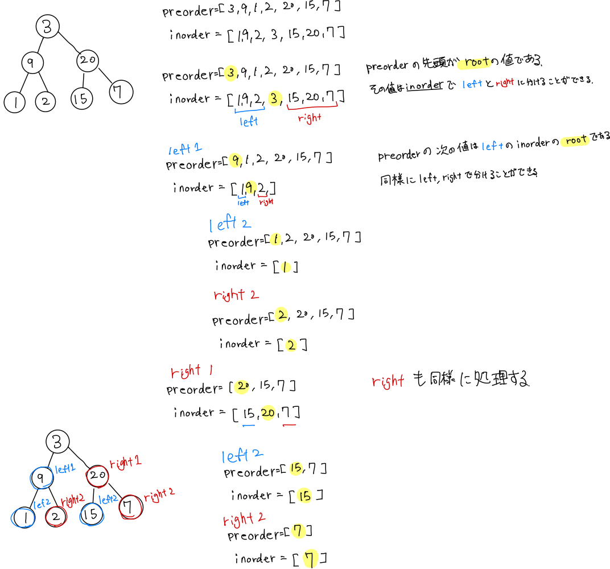
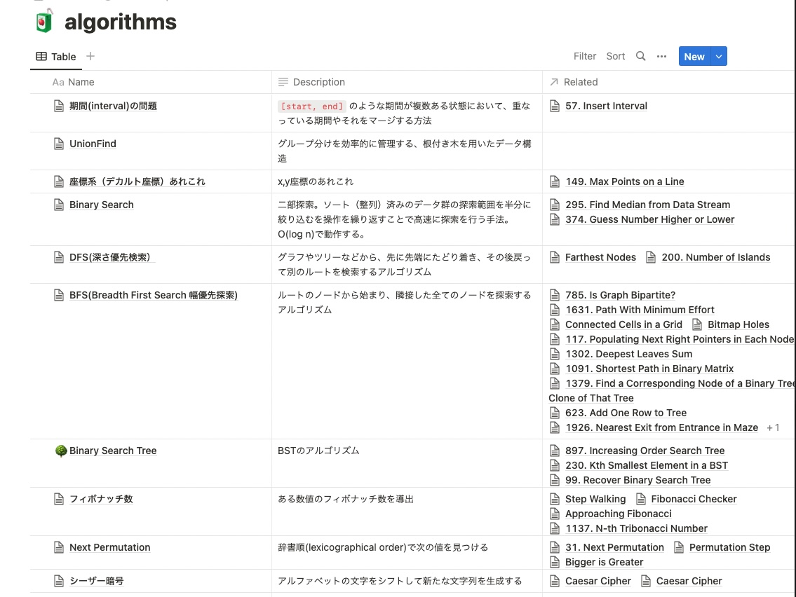
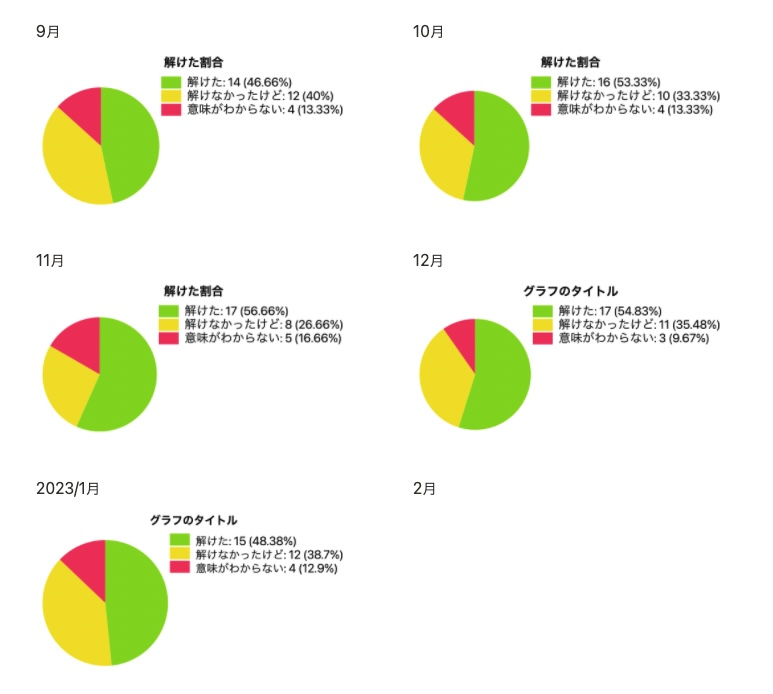
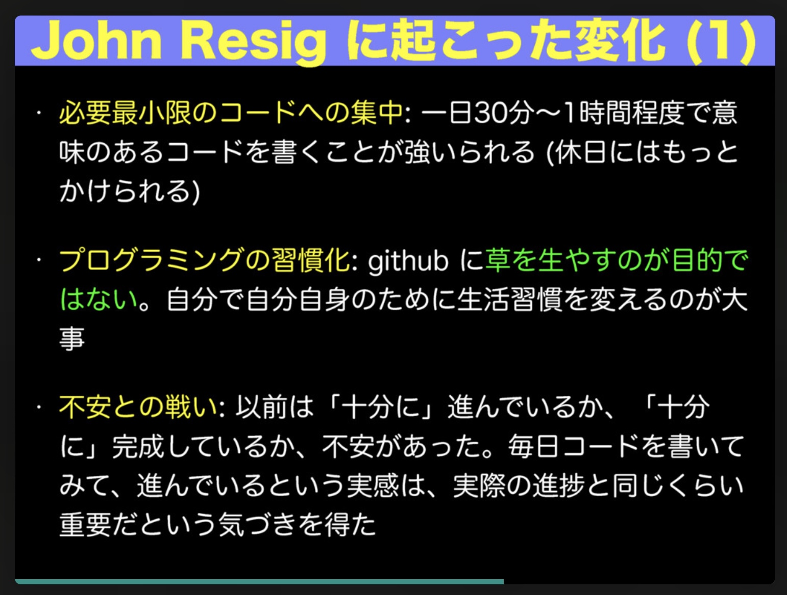

+++
title="LeetCodeに挑戦して1年間過ごした話"
[taxonomies]
tags=["Programming"]
+++

去年の今頃（2022 年 1 月）くらいから、コーディングチャレンジを始め、Leetcode での問題解答のストリーク日数が 365 に達したので振り返りも含めて、やってきたこと書いてみようと思う。

[https://leetcode.com/kyohei8/](https://leetcode.com/kyohei8/)

## コーディングチャレンジとは

プログラミングコンテストやコーディングテストなどと言われてて、正式な名称はわからないのだけど、オンライン上のサイトで出題されている設問に対して、コードを書いて提出し、正解・不正解を判定するというもの。

一般的にはこれらに企業への面接のセットがされていたりするのだけど、自分はそこまではやっておらず、あくまで個人的なスキル向上のためにやってます。

### 挑戦の理由

一昨年末、当時フリーランスだった自分は転職活動をしていたのだけど、とある企業の面接の時に、あるアルゴリズムを利用して、回答するといういわいるテクニカルインタビューがあったのだけど、当時の自分では全然答えられなかったことが悔しかったことにある。

こういったアルゴリズムを利用してコードを書くということは、実際に業務でコードを書いている分には、あまりでて来ず、出てきたとしてもブルートフォースでなんとかなったりするので、特に勉強してこなかったという経緯もあって、さすがにこのままでは良くないと思い、それから、[Coderbyte](https://coderbyte.com/)、[HackerRank](https://www.hackerrank.com/)、[LeetCode](https://leetcode.com/)の３つのサイトに登録し、サイトに出題されている問題を少しずつでも解き続けて、アルゴリズムを理解していこうと始めたのがきっかけである。

あとは、Node.js でおなじみの古川さん ([@yosuke_furukawa](https://twitter.com/yosuke_furukawa)) が以前にやられていて（今もかな？）それに感化されたというのもあります。

[https://twitter.com/yosuke_furukawa/status/1294460648999403520](https://twitter.com/yosuke_furukawa/status/1294460648999403520)

### 続けること

一番難しいのはアルゴリズムを覚えることではなく、雨の日も風の日も、休みの日も仕事で疲れている日も、飲み会から帰ったときも(笑)、毎日解き続けることである。去年の途中から新しい会社に入ったこともあり、日中は業務をしながらやり続けるのは結構に大変だった。

それでもなんとか時間を作り、コツコツと解き続け、1 年が経った 2023 年 2 月現在でも 1 日 1〜2 問ずつ解くことを続けている。

## やったこと

登録したサイトの概要とリストを載せる。

### LeetCode

この手のサイトで最大手になるのかな？問題や回答の説明の質が高く、ディスカッションも充実している。問題数も 2000 問近くある。

LeetCode では毎日ランダムで問題が出題され、その日のうちに解くとポイントが貰え、ストリークが増えていくという仕組みがあり、それを毎日続けたということが本記事で書きたかったことになる。

設問のリスト
[https://leetcode.com/problemset/all/](https://leetcode.com/problemset/all/)

### HackerRank

HackerRank も同様に人気があるサイト（だと思う）である。
設問自体はたくさんあるが、設問そのものはユーザが投稿するもの？のようで、問題の質にばらつきがあり、序盤は良かったが、中盤から意味がわからないものが多くなり、解くことよりも問題を理解するほうが時間がかかってしまうことが増え、それが原因で途中で止めてしまった。。

一応は 146 問解いたけど・・

リスト
[https://www.hackerrank.com/domains/algorithms](https://www.hackerrank.com/domains/algorithms)

### Coderbyte

正直あまりメンテナンスもされておらず、サイトとしてもかなり怪しいのだけど、自分のような初学者向けにはいいかなと思って登録しました。有料版でないと全部の問題を解くことはできないので、有料登録をしてやりました。問題の質はかなりゆるく、制限などがだいぶ曖昧。問題数は全部で 261 問、変わり種としては React や vue.js, SQL の問題がありました。

2022 年 9 月の時点で全問解いたので卒業しました笑。

リスト
[https://coderbyte.com/challenges](https://coderbyte.com/challenges)

最初は意気揚々と 3 サイトに登録してやっていたのだけど、就業して時間の確保が難しかったことと、上記の理由で続けられなくなったので今は LeetCode のみを続けています。

## やってみて

振り返ってつらつらと。

### 始めてみる

序盤は上記にある通り、Coderbyte, HackerRank, Leetcode を掛け持ちしてやっていたので、1 日に 3 問くらいのペースで解いていた。

はじめの頃はそもそものアルゴリズムが分からなくて、解けないので答えを見ながら(笑)、一つずつアルゴリズムを覚えていった。

３つのサイトをやっていると、同一のアルゴリズムを利用する問題が各サイトで違う形で出題されているということが多くあり、こうして問題とアルゴリズムを結びつけていくことが大事だとわかった。

### 徐々にわかってくる

そんな感じでしばらくやっていると、問題を読んだときにこれはあのアルゴリズムだよなー…とまず、気づけるようになる。

始めてみる前は分からなかったけど、基本的にこの手の問題を解くためのアルゴリズムは有限で、しかもメインなものは 20 種類くらいしかないのだとわかってくる。

あとは問題を解読し、どのアルゴリズムを組み合わせるかだけである。

そこからは閃きでなので、それはそれで難しいだけど笑

### わかってはきたけど…

やっていく上でどうしてもわからない問題に出くわすこともある。最初の頃は多かったし、今でも全然ある。

解けないものは解けないので、そういう場合は潔く解答諦めて、答え（解説）をみて、それをできるだけ理解したことにしている。（でも答えをみても理解できないものも結構ある 🤯）

### 理解すること

ただ解いているだけだと、自分はすぐ忘れてしまう人間なので、できるだけ記録を取り、あとで振り返えられるようにしている。

Notion に解いた問題の概要、（個人的な）難易度、解き方、コードサンプルなどを記録していく。

2023 年 1 月の記録

テキストだけだと書ききれない場合は iPad で手書きで挿絵なんかも取り入れたりしている。

こんな感じで書いているが、自分でも読み返せるのか相当怪しいけど笑

あとは、頻出するアルゴリズムをまとめて別のページでまとめているものも作ったりした。

## 1 年でなにが変わった？

### アルゴリズムを覚えた

1 年間やってみて、よく利用されるアルゴリズム、BFS,DFS,backtraking,BinarySearch,…などなど、はだいたいわかってきて、空で（調べたりせず）解ける問題も少しずつ増えてきていると感じる。

ただ、DP(動的計画法)は相変わらず苦手、DP 自体の意味がわかるのだけど、そこに至る計算式のようなものを導きだすの難しい、解説を読んでも理解できないことがある。。
あと、ベルマン-フォワード法とかあまりでてこない系のアルゴリズムはまだ理解できていない。
数学系の問題も公式がわからないので、解けないことが多い。

### Rust 言語の学習

言語は基本的に JavaScript を利用しているが、最近は Rust の勉強もしているため、JS で解く →Rust で書き直すということもやっている。

Rust も Rust で難しく、js ならちょちょいとやれることも、毎回ググりながらになってしまうけど少しずつ覚えている感覚が楽しかったりもする。

### LeetCode での解答できる問題の傾向

LeetCode には Easy/Medium/Hard と難易度が設定されているのだけど、
Easy の問題はだいたい解ける。ごく稀に設問の意味が難しくて解けない場合はあったりする。
Medium は問題から利用するアルゴリズムさえわかっていれば解くことができる。
Hard はいまだに解けない問題がほとんど、自分なりに解けたと思えるのは体感で 1 割くらいだろうか。

### 解けた割合

自分なりに解けたと思える問題の割合をグラフ化してみたりする。

割合が増えているのがどうかかなり微妙だけど・・・

### 続けること

冒頭にも書いたけどやはり毎日続けるということが本当に難しい、時間があるときであればいいけど、仕事で疲れているときは、さっと終わらせてもいいよなーと思いつつも、それだったらあまりやる意味がないよなあという思いで揺れています。けど、少しずつ新しいことを覚えているという感覚が楽しく、昨日は解けなかった問題が今日は解けるようになったというのがやっぱり一番嬉しい体験なんだなと思います。

### Write Code Every Day

毎日コードを書く意味があるのかないのか自分にはわからないけど、コードを書いているとなんだか**正気を保てる感覚**が自分にも昔からあって、それで続けているという面も結構ある。

その昔、jQuery の作者である John Resig が [Write Code Every Day](https://johnresig.com/blog/write-code-every-day/)という記事で書いてて、それをまとめたのがこのスライドがこれだけど、
[https://speakerdeck.com/twada/write-code-every-day](https://speakerdeck.com/twada/write-code-every-day)

このスライドの「不安との戦い」というのがそれなのかな、と思ってみたり。

## これから

1 年やったけど、正直まだまだ理解していないことは多く、解答を見ないと解けない問題も多いので、続けていって、空で解ける問題を増やしていきたい。

あと、2023/2 月時点での LeetCode の保有ポイントは 5000 ポイントで、LeetCode の Laptop Sleeve が 8000 ポイントでもらえるらしいので、それはなんとかして手に入れたいな笑

[Free Souvenirs](https://leetcode.com/store/)
