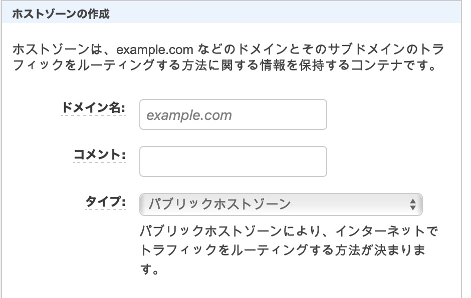
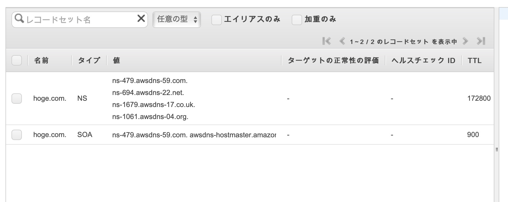
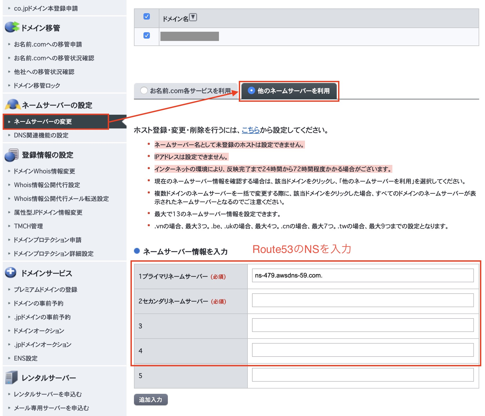

+++
title="お名前.comで取得したドメインをamplifyのドメインに指定する"
[taxonomies]
tags = ["AWS", "Route53", "amplify", "domain"]
+++

aws Amplify でホストしたいサイトのドメインを、お名前.com で取得したドメインを設定する場合以下の手順を利用します。

前提として

- お名前.com でドメインを購入した状態
- AWS Amplify で何かしらサイトを作成している状態

とします。

## ネームスペースを移行

まず、aws Route53 でホストゾーンを作成します。

以下を設定し生成。

- [ドメイン名]はお名前.com で取得したドメインを入力
- [コメント]は空で OK
- [タイプ]はパブリックホストゾーンを選択

生成すると、以下のようにホストゾーンが生成される。

このタイプ NS の値をお名前.com の方で設定します。

お名前.com の設定画面を開き、「ネームサーバーの変更」-> 「他のネームサーバを利用」を選択し、先程 NS の値を 1 から 4 に入力し、保存します。

## Amplify へのドメインの設定

Ampify のドメインの管理で先程 Route53 に登録したドメインがプルダウン上に存在しているので、選択します。

しばらくすると選択したドメインで amplify のサイトが表示できるようになります。
