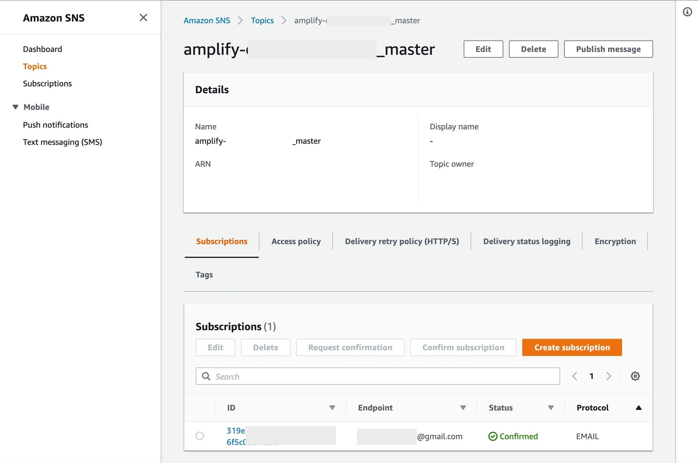

+++
title="Amplifyのデプロイ通知をSlackに通知する"
[taxonomies]
tags=["Lambda", "Slack", "amplify", "sns"]
+++

amplify で deploy 完了時、メールで通知することができるが、
いちいちメールが飛んでくるのが結構邪魔になるのでそのイベントを
Slack に通知するようにしたい。

具体的には AWS Amplify の Email notifications を設定するとそのメールをもとに AWS の SNS が設定されるので
その設定に相乗りする形で Lambda を使って Slack に通知を送るというものです。

## Slack の Incoming WebHooks を作成

https://[YOUR_ORG].slack.com/apps から Incoming WebHooks を検索し、アプリを追加します。

新規の Incoming WebHooks を追加し、Webhook URL が発行されます。
Customize Name、Icon 等は呼び出し時に上書きするでデフォルトのままで良いです。

## AWS Lambda を作成

SNS から送信されたメッセージを Slack の webhook に送信する処理を Node.js を使って記述します。


SNS から Lambda が起動されるとき、
第一引数の event の中身は以下のようなオブジェクトになっているので、
`Sns.Message`の部分をうまくパースして各状態（開始、成功、失敗）の値を取り出します。

```js
// eventの中身
{
  Records: [
    {
      EventSource: 'aws:sns',
      EventVersion: '1.0',
      EventSubscriptionArn: 'arn:aws:sns:ap-northeast-1:...',
      Sns: {
        Type: 'Notification',
        MessageId: '5d6ef129-e0b3....',
        TopicArn: 'arn:aws:sns:ap-northeast-1:....',
        Subject: null,
        Message:
          '"Build notification from the AWS Amplify Console for app: https://... Your build status is STARTED. Go to ..."',
        Timestamp: '2019-07-09T10:41:43.599Z',
        SignatureVersion: '1',
        Signature: 'MwvX3GHzK...',
        SigningCertUrl: '<https://sns.ap-northeast-1.amazonaws.com/xx.pem>',
        UnsubscribeUrl: '<https://sns.ap-northeast-1.amazonaws.com/>...',
        MessageAttributes: {}
      }
    }
  ];
}
```

Lambda の関数は以下のようなします。

```js
const https = require('https');
const AMPLIFY_STAT = {
  STARTED: 'STARTED',
  SUCCEED: 'SUCCEED',
  FAILED: 'FAILED'
};

/**
 * snsから送られてくるメッセージをparse
 */
const parseSnsMessage = (event) => {
  if (!event.Records && Array.isArray(event.Records)) {
    return {
      text: 'deploy failed!(parse failed)'
    };
  }

  if (!event.Records[0].Sns && !event.Records[0].Sns.Message) {
    return {
      text: 'deploy failed!(parse failed)'
    };
  }

  const msg = event.Records[0].Sns.Message;
  const mathcher = msg.match(/Your build status is (\\w+)./);

  let text = '';
  if (mathcher) {
    const stat = mathcher[1];
    switch (stat) {
      case AMPLIFY_STAT.STARTED:
        text = 'deploy started...';
        break;
      case AMPLIFY_STAT.SUCCEED:
        text = 'deploy succeed!';
        break;
      default:
        text = 'deploy failed!';
    }
  }

  return {
    text
  };
};

exports.handler = async (event) => {
  const { text } = parseSnsMessage(event);
  // slackのincoming hookへ送信
  const data = JSON.stringify({
    channel: '#playground',
    username: 'amplify-deploy-state',
    text,
    icon_emoji: ':smirk_cat:'
  });

  const options = {
    hostname: 'hooks.slack.com',
    port: 443,
    path: '/services/xxxx/xxxx/xxxx', // ここにwebhookのURLを設定します。
    method: 'POST',
    headers: {
      'Content-Type': 'application/x-www-form-urlencoded',
      'Content-Length': data.length
    }
  };

  return new Promise((resolve, reject) => {
    const req = https.request(options, (res) => {
      res.on('data', (d) => {
        resolve({ statusCode: res.statusCode });
      });
    });

    req.on('error', (error) => {
      console.error(error);
      reject(error);
    });
    req.write(data);
    req.end();
  });
};
```

Lambda の関数をテストする際は template に`Amazon SNS Topic Notification`があるのでそれを利用すると便利です。


## SNS に Lambda を追加する

冒頭で説明した通り、Amplify でメール通知を設定した場合、sns の topic がつかされているのでそれを参照します。



Create subscription から新しい Subscription を作成します。


Protocol に`AWS Lambda`を、Endpoint に先程作成した Lambda 関数を指定します。

## 通知テスト

AWS Amplify のコンソールから redeploy 等を実行すると。
通知が slack に来ることが確認できます。


確認ができたら SNS についている、Email の方の Subscription は削除してもらって問題ないと思います。（もし必要になったら再度つければいいと思います）

## Reference

- Incoming Webhooks | Slack
  [https://api.slack.com/custom-integrations/incoming-webhooks](https://api.slack.com/custom-integrations/incoming-webhooks)
