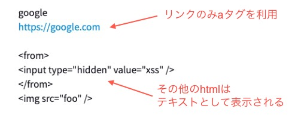

+++
title="Reactで安全にリンクを出力する"
[taxonomies]
tags=["Node.js", "React"]
+++

React で入力されたテキストに URL が含まれている場合に、出力する側でその URL を判定し、自動的に a タグを適応したい。
利用するライブラリは以下の 2 つ

- [Anchorme](http://alexcorvi.github.io/anchorme.js/)
- [js-xss](https://github.com/leizongmin/js-xss)

## ライブラリ

### Anchorme

テキストに含まれている URL ライクな文字列を自動的に a タグに変換してくれる。

```ts
import anchorme from 'anchorme';

const text = 'hello https://google.com link.';

const htmlText = anchorme({
  input: text,
  options: {
    attributes: () => {
      const attributes = {
        target: '_blank',
        rel: 'noopener noreferrer'
      };
      return attributes;
    }
  }
});

console.log(htmlText);
// hello <a href="https://google.com" target="_blank" rel="noopener noreferrer">https://google.com</a> link.
```

上記の通り、URL ライクな文字列を a タグに変換してくれます。

デフォルトでは google.com などの `https://` がつかない場合も変換されます。その場合はオプション等で変更することになります。

```ts
options: {
  exclude: function(string) {
    if (!string.startsWith("https://")) {
      return true;
    } else {
      return false;
    }
  }
},
```

本当はタグの変換はクライアント側で変換せず、サーバ側で変換される方が望ましいと思います。

### js-xss

js-xss は html ライクな文字列を評価し、xss が発生しない安全な文字列に変換(サニタイズ)してくれます。

react 上で html を表示したい場合、やむを得ず `dangerouslySetInnerHTML` を利用することになりますが、ユーザ側で入力されたものなど安全ではないテキストを表示したい場合このライブラリを使って危険な html 構文を取り除くことができるようになります。

js-xss は[デフォルト](https://github.com/leizongmin/js-xss/blob/master/dist/xss.js#L13)で form タグや script タグを除外するようにフィルターを持っています。今回は a タグのみを対象（許可）としたいので以下のようにしました。

```ts
<span
  dangerouslySetInnerHTML={{
    __html: filterXSS(htmlText, {
      whiteList: {
        a: ['href', 'title', 'target', 'rel']
      }
    })
  }}
/>
```

以上によって、リンクのみを a タグで表示し、その他のタグはサニタイズされた状態で表示できるようになりました。


