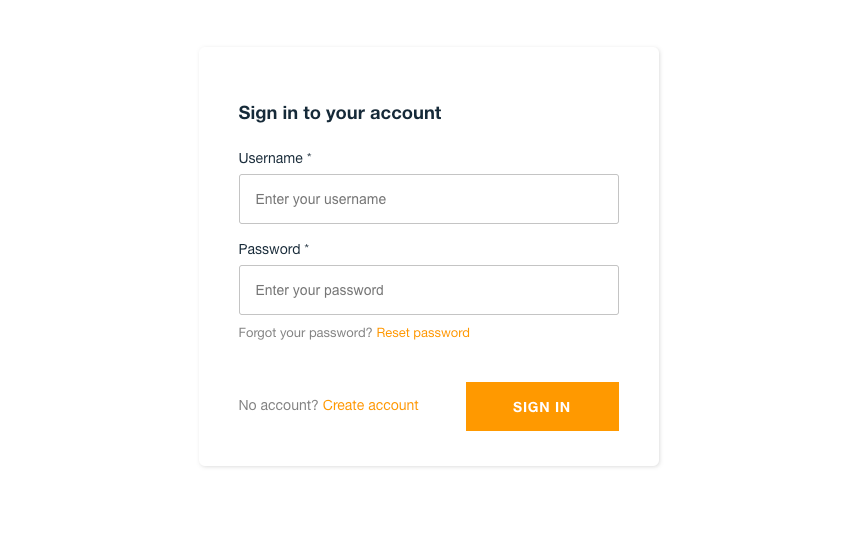

+++
title="AWS Amplify + Cognito + Next.jsで認証付きページ作る"
[taxonomies]
tags=["AWS", "Next.js", "amplify", "cognito"]
+++

AWS Amplify + Cognito + Next.js で認証付きページ(ログインが必要なページ)を作る方法です。

## モチベ

やりたいこと

- とあるプロダクトの管理画面を作りたい
- 管理画面はプロダクトサイトとは別の場所(ドメイン)で作成し、プロダクトサイトと切り離す。
- 管理ユーザ用のテーブルは作りたくない
- 認証機能を 0 から作るのは面倒なので、Cognito の認証機能を利用したい。（UI も含め）
- データソースはプロダクトサイトと共通のものを利用することになる。
- 画面とデータソースをつなぐ API 自体は管理画面用に作成する（本来はここも切り離したいが）

上記のような要件を満たしたいたいため、
画面側を Amplify(frontent) + Next.js で作成し、認証機能を Amplify の Authentication を使い、認証ユーザ（管理ユーザ）のデータを Coginito で管理するようにしました。

## Amplify とは

AWS Amplify とはなにかと一言で説明するのは難しいのですが、自分が思うのは Amplify はインターフェイスみたいなもので、裏側では AWS の各種サービスを組み合わせ、オーケストレーションしているサービスみたいなものかなと思います。
Amplify から利用されるサービスは IAM、Lambda、CloudFormation、Cognito、AppSync などがあります。できることは結構多いです（そして覚えることも）。

## Amplify Framework

主な Framework には例として、以下のものがあります

- Amplify CLI ... バックエンド機能のシンプルな CLI 機能を提供
- Amplify Libraries ... ユースケースを中心としたクライアントライブラリで、宣言的なインターフェイスを実装することでバックエンド使えるようにする
- Amplify UI Components ... React, Vue, RN などの UI ライブラリ
- Amplify Console ... AWS のサービスで git ベースのワークフロー、継続的なデプロイ、ホスティングなどクラウドを使ったフルスタックな機能を提供。（CLI で操作できる内容と同じ）

## Amplify をインストール

ローカル環境に、npm を利用して、Amplify CLI をインストールします。

```bash
npm install -g @aws-amplify/cli
```

### Amplify の初期設定を行う

Amplify CLI の初期設定として、デプロイを行うユーザ(IAM)を作成し、アクセスキーを登録します。
※ 詳細はこちらのビデオを参照、[https://youtu.be/fWbM5DLh25U](https://youtu.be/fWbM5DLh25U)

```bash
amplify configure
```

## Next.js のアプリを作成

ひとまず、ローカルで動作する Next.js の環境を作ります。

[こちらの記事](https://1k6a.com/blog/blazing-fast-build-nextjs-local)のような、プレーンな Next.js でもよいですし、[create-next-app](https://nextjs.org/docs/api-reference/create-next-app)でもいいです。

<aside>
⚠️ ただし、Next.jsのバージョンはv9系もしくはv10.2.0としてください。それ以上のバージョンではAmplify上でnext.jsのAPI routesが動きません。(2021/06/14現在)

</aside>

## Amplify の backend service を作成

Amplify の backend 機能は、notifications, analytics, api など多数の機能を選択して利用することができます。今回は Authentication だけ利用したいのでそれを追加します。

プロジェクトの Amplify を定義するため、ルートディレクトリで以下を実行します。

```
amplify init
```

基本的にはデフォルトで良いですが、以下の点を変えます。

- Project Name は固有のもの（記号は使えない、大文字小文字は区別できる）
- Next.js を利用するのであれば、Distribution Directory Path を `.next` とします

```bash
Note: It is recommended to run this command from the root of your app directory
? Enter a name for the project nextamplified
The following configuration will be applied:

Project information
| Name: nextamplified
| Environment: dev
| Default editor: Visual Studio Code
| App type: javascript
| Javascript framework: react
| Source Directory Path: src
| Distribution Directory Path: .next
| Build Command: npm run-script build
| Start Command: npm run-script start
```

init が行われるとローカルの環境に、

- `amplify` というディレクトリが作成され、そこにバックエンドをのスタックを定義するためのコードが追加されていく。
- `src` ディレクトリに `aws-exports.js`というファイルが作成され、amplify で作成したサービスの設定を保持する。これにより amplify クライアントがバックエンドサービスの情報を取得することができる。Amplify CLI を使ってカテゴリーを追加・削除したり、バックエンドの設定を更新すると、aws-exports.js の設定が自動的に更新されます。
- `.gitignore` に amplify で追加されたファイルの中でコミットが不要なものが追加される

また、AWS Amplify にプロジェクトが作成され、その backend に `dev` という環境が作成されます。
その際、自動で作成される AWS 側のサービスとして

- AWS CloudFormation に amplify-nextamplified-dev-xxx のようなオーケストレーションの設定
- S3 に amplify-nextamplified-dev-xxx-deployment バケット（amplify の設定ファイルを保持）
- IAM Role に認証ユーザ用のそれぞれのロールができる(後述の auth のためのロールと思われる）
  - amplify-nextamplified-dev-xx-authRole,
  - amplify-nextamplified-dev-xx-unauthRole

CloudFormation のログをみると以下のようになっているので、おそらく Amplify が cloudformation をキックして各種サービス生成するという流れなのかなと思います。


## Amplify の Auth を追加

Amplify 環境ができたので次に認証機能を追加します。

```
amplify add auth
```

Cognito の設定を聞かれるので、回答していきます。
今回は Email でのログインを行いたいのでそのように設定します。

```
Using service: Cognito, provided by: awscloudformation

 The current configured provider is Amazon Cognito.

 Do you want to use the default authentication and security configuration? Default configuration
 Warning: you will not be able to edit these selections.
 How do you want users to be able to sign in? Email
 Do you want to configure advanced settings? No, I am done.
Successfully added auth resource xyzaadminb16d7f70 locally
```

## バックエンドのデプロイ

設定ができたら、push コマンドでデプロイを行います。

```
amplify push
```

Auth の設定が Amplify 上に追加されます

```
✔ Successfully pulled backend environment dev from the cloud.

Current Environment: dev

| Category | Resource name         | Operation | Provider plugin   |
| -------- | --------------------- | --------- | ----------------- |
| Auth     | nextamplifiedcxxxxxxx | Create    | awscloudformation |
```

実行すると以下のサービスに amplify 用の設定が追加されます

- Cognito のユーザプール
  - Auth を設定した場合に、nextamplifiedxx_userpool_xx-dev のようなユーザプールが作成される
- Role
  - lambda, cognite それぞれのサービスロールができる
- lambda
  - amplify-nextamplified-dev-UpdateRolesWithIDPFuncti-XXXX
  - amplify-nextamplified-dev-105-UserPoolClientLambda-XXXX
  - 及び、その lambda が実行されたログが CloudWatch に作られる

## フロント側に認証機能を追加する

backend がデプロイされたので、今度はフロント側に認証機能を呼び出す処理を追加します。

### Amplify libraries のインストール

Amplify 用の js ライブラリをインストールします。今回は以下の 2 つを利用します。

```
npm install aws-amplify @aws-amplify/ui-react
```

- `aws-amplify` ... 作成されたアプリケーションで Amplify を動かすためのメインライブラリ
- `@aws-amplify/ui-react` ... React で構成されたアプリケーションを構築するための UI コンポーネント

### 認証機能のコンポーネントを追加

index.tsx を以下のようにします

```tsx
import { Amplify } from 'aws-amplify';
import { NextPage } from 'next';
import React from 'react';

import { AmplifyAuthenticator } from '@aws-amplify/ui-react';

import awsExports from '../aws-exports';

Amplify.configure({ ...awsExports });

const Index: NextPage<{}> = () => {
  return (
    <AmplifyAuthenticator>
      <div>ようこそ</div>
    </AmplifyAuthenticator>
  );
};

export default Index;
```

保存し、localhost:3000 にアクセスすると、初回はログインしていないので、ログイン画面が表示されます。



### サインアップを非表示にする

今回はサインアップを行わないので、`<AmplifyAuthenticator>`内の slot `AmplifySignIn` に hideSignUp を追加します。

```tsx
<AmplifyAuthenticator>
  <AmplifySignIn slot="sign-in" hideSignUp />
</AmplifyAuthenticator>
```

## ログインユーザを登録

AWS のコンソールから Cognito 画面を呼び出し、その中でユーザを登録します。
ユーザ名が email となるよう設定したので、username はメールアドレスで指定します。


Cognito 上でのユーザの追加

ログインが行われ認証されたユーザのみ UI が表示されるようになりました。


## frontend のデプロイ

ローカルで認証機能の確認できたので、Amplify に deploy をします。プロジェクトの git を作成し、github 等のリモートホストに push します。

### Amplify hosting を追加

Next.js の SSR を利用するため、hosting を追加します。

```
amplify add hosting
```

```
? Select the plugin module to execute Hosting with Amplify Console (Managed hosting with custom domains, Continuous deployment)
? Choose a type Continuous deployment (Git-based deployments)
? Continuous deployment is configured in the Amplify Console. Please hit enter once you connect your repository
```

コンソールが開くので frontend タブから該当する git のリモート先を選択し、設定します。
設定が完了するとビルドが実行されるので完了するのを待ちます。

このときにデプロイ先の CloudFront、S3 が作られます。


デプロイ完了後、作成された URL https://main.xx.amplifyapp.comにアクセスすると画面が表示されます。

以上まずログインができるところまでを書きました。実際に cognito のユーザが正しいかなどは後で書きます。

## その他 tips など

### サーバ上で Next.js /api が動かない

上に書いたとおり、2021/06/14 現在最新の Next.js のバージョンは v10.2.3、現状 Amplify がサポートしているのが v9 であり 10.2.0 より上のバージョンだと Lambda Edge がエラーになるようで、Cloudfront のエラーがでて動かないです。
[https://github.com/aws-amplify/amplify-console/issues/1915](https://github.com/aws-amplify/amplify-console/issues/1915)
オフィシャルのドキュメントでは以下のように書かれています。

[https://docs.aws.amazon.com/ja_jp/amplify/latest/userguide/server-side-rendering-amplify.html](https://docs.aws.amazon.com/ja_jp/amplify/latest/userguide/server-side-rendering-amplify.html)

> Your Next.js app uses unsupported features
> You can deploy an app created with Next.js version 10. However, Amplify doesn't currently support the full feature set. Amplify supports all features of Next.js versions 9.x.x, except for Incremental Static Regeneration (ISR).

### Amplify のアプリを削除する場合

コンソールから削除を選択した場合ローカル環境の amplify ディレクトリが残ってしまうので、以下のコマンドで削除するほうがよいです。

```bash
amplify delete
```
