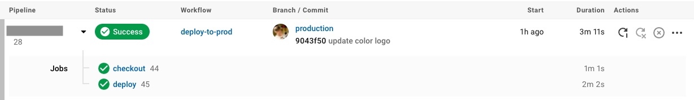

+++
title="CircleCIでvercelにデプロイする(2021年版)"
[taxonomies]
tags=["CircleCI", "deploy", "vercel"]
+++

CircleCI を利用して GitHub の push から自動的に vercel のプロジェクトへデプロイする方法です。2019 年頃、まだ vercel が now だった時代にやっていたのですがいろいろ変わったので再度設定してみました。

## TL;DR;

自分の場合は CircleCI の config ファイルを以下のように設定し、GitHub に push することで自動的にデプロイが実行されます。

```yaml
version: 2.1

orbs:
  node: circleci/node@4.7

jobs:
  checkout:
    executor: node/default
    working_directory: ~/tmp/project-frontend
    steps:
      - checkout
      # Download and cache dependencies
      - node/install-packages
      # 次のdeployをするためにディレクトリを永続化
      - persist_to_workspace:
          root: .
          paths:
            - .
  deploy:
    executor: node/default
    working_directory: ~/tmp/project-frontend
    steps:
      - attach_workspace:
          at: ~/tmp/project-frontend # 前のjobの成果物をダウンロード
      - run:
          name: Install Vercel CLI
          command: sudo npm install --global vercel
      - deploy:
          name: Deploy & Alias
          command: |
            if [ "${CIRCLE_BRANCH}" == "staging" ]; then
              DEPLOYMENT_URL=$(vercel -S your_team -t $VC_TOKEN --confirm -A ./vercel.json)
              vercel -S your_team -t $VC_TOKEN alias set $DEPLOYMENT_URL staging.project.com
            elif [ "${CIRCLE_BRANCH}" == "production" ]; then
              DEPLOYMENT_URL=$(vercel -S your_team -t $VC_TOKEN --confirm -A ./vercel.json --prod)
            fi

# Invoke jobs via workflows
workflows:
  deploy-to-stage:
    jobs:
      - checkout:
          filters:
            branches:
              only:
                - staging
      - deploy:
          requires:
            - checkout
          filters:
            branches:
              only:
                - staging
  ...
```

以下、解説

## 下準備

### vercel のプロジェクトを作成

予め vercel 上のプロジェクトを作成しておきます。

ローカルで vercel コマンド実行することで、vercel 上にプロジェクトを作成、デプロイできるので、事前に行います

vercel コマンドの詳細はこちらを確認ください

[CLI](https://vercel.com/docs/cli)

### CircleCI の登録

CircleCI へサインアップまたはサインインし、デプロイ対象であるリポジトリを登録します。

### アクセストークンの設定

CircleCI から vercel にアクセスするため、vercel のアクセストークンが必要になるため、vercel のサイト上の Personal Account Settings > Tokens から新しいトークンを生成します。
生成した、トークンを CircleCI の Project Settings の Environment Variable から追加します。


CircleCI にトークンを設定

設定したトークンは（この例だと） `$VC_TOKEN` でアクセスできます。

## Config について

今回は CircleCI の v2.1 を利用します。v2.1 から CircleCI では Orb と呼ばれるビルドの設定を個別のパッケージにし、再利用できる仕組みが利用できます。

[https://circleci.com/orbs/](https://circleci.com/orbs/)

[CircleCI Orbs](https://circleci.com/orbs/)

vercel のプロジェクトでは主に Node.js を利用するのでオフィシャルの node の Orb を利用します。

これにより docker の設定を自前で書かなくてもよくなり、 `node/install-packages` を利用することによって npm ci とインストールしたパッケージを自動的にキャッシュ（キャッシュ先はデフォルトで `'~/.npm'` ）してくれます。

[https://circleci.com/developer/orbs/orb/circleci/node](https://circleci.com/developer/orbs/orb/circleci/node)

[CircleCI Developer Hub - circleci/node](https://circleci.com/developer/orbs/orb/circleci/node)

```yaml
version: 2.1

orbs:
  node: circleci/node@4.7
```

### jobs の設定

jobs は 2 つ登録します

- checkout
  - working_directory のディレクトリ名は vercel のプロジェクト名と同じにします。
    - vercel の `—name` オプションで指定してもよいが、現状は deprecated なのであまり利用したくはない
    - circleCI の workspace ディレクトリ上に.vercel/project.json を作成するという方法もあるが、煩雑になるのとセキュアなのかもわからないので、この方法も一旦パスしました。
  - github からソースコードをダウンロードし、パッケージのインストールを行います
  - `persist_to_workspace` で続く deploy にファイル（npm で install したもの）を渡すため、ディレクトリを永続化します

```yaml
jobs:
  checkout:
    executor: node/default
    working_directory: ~/tmp/project-frontend
    steps:
      - checkout
      # Download and cache dependencies
      - node/install-packages
      # 次のdeployをするためにディレクトリを永続化
      - persist_to_workspace:
          root: .
          paths:
            - .
```

- deploy
  - vercel cli を利用して vercel の環境にデプロイを行います。
    - 今回は `staging`ブランチを vercel の preview モードとし、staging のサブドメインでアクセスし、 `prodution` モードを本番とて運用にすることを想定します
    - shell 上で `DEPLOYMENT_URL=$(vercel ...)` のように vercel コマンドの戻り値が vercel の deployment の URL(eg. `porject-frontend-5rz1qnta0-ahdee.vercel.app` )となるので、その URL に対し、alias で URL を当てることにより、最新の deployment が staging の URL に向くようにします
      - ref: [https://github.com/vercel/vercel/discussions/4523#discussioncomment-20480](https://github.com/vercel/vercel/discussions/4523#discussioncomment-20480)
    - 本番（production モード）では自動的に URL が割り当てられるため、設定は特にしていません
  - attach_workspace で前述の checkout で生成したものをダウンロードし展開します。

```yaml
deploy:
  executor: node/default
  working_directory: ~/tmp/project-frontend
  steps:
    - attach_workspace:
        at: ~/tmp/project-frontend # 前のjobの成果物をダウンロード
    - run:
        name: Install Vercel CLI
        command: sudo npm install --global vercel
    - deploy:
        name: Deploy & Alias
        command: |
          if [ "${CIRCLE_BRANCH}" == "staging" ]; then
            DEPLOYMENT_URL=$(vercel -S your_team -t $VC_TOKEN --confirm -A ./vercel.json)
            vercel -S your_team -t $VC_TOKEN alias set $DEPLOYMENT_URL staging.project.com
          elif [ "${CIRCLE_BRANCH}" == "production" ]; then
            DEPLOYMENT_URL=$(vercel -S your_team -t $VC_TOKEN --confirm -A ./vercel.json --prod)
          fi
```

## workflow

job の設定が済んだら、それらを動かす workflow を設定します。workflow は staging ブランチ、production ブランチで job の checkout, deploy を実行するだけです。

ブランチ毎で分けたいので以下のような設定になります。

```yaml
# Invoke jobs via workflows
workflows:
  deploy-to-stage:
    jobs:
      - checkout:
          filters:
            branches:
              only:
                - staging
      - deploy:
          requires:
            - checkout
          filters:
            branches:
              only:
                - staging
  deploy-to-prod:
    jobs:
      - checkout:
          filters:
            branches:
              only:
                - production
      - deploy:
          requires:
            - checkout
          filters:
            branches:
              only:
                - production
```

これで GitHub へ push すると以下のように staging ブランチでは deploy-to-stage が、production ブランチでは deploy-to-prod が動作します。また main ブランチの場合は対応する workflow がないためなにも起きません。



以上になります。

テストの自動実行や slack の通知なども追加できたらいいなと思います。

## 参考

- [https://circleci.com/docs/ja/2.0/configuration-reference/](https://circleci.com/docs/ja/2.0/configuration-reference/)
